# Campaña de Instagram · Lima Flores

3 productos del catálogo, 3 anuncios cada uno. Copy y creativos hechos íntegramente con Claude.

```
node marketing/ig-ads/build.mjs     # regenera los 9 creativos y este README
```

| Anuncio | Producto | Etapa | Formato | Titular |
| --- | --- | --- | --- | --- |
| `IG-05` | Orquídeas grandes en maceta | Consideración / Retargeting 30 días | 4:5 | «Siguen vivas dos meses después» |
| `IG-06` | Orquídeas grandes en maceta | Retargeting caliente | 9:16 | Cuando el ramo no alcanza |
| `IG-07` | Ramo de flores Sofía | Frío | 4:5 | No mandes rosas rojas |
| `IG-08` | Ramo de flores Sofía | Frío — marca | 4:5 | Nadie arma dos iguales |
| `IG-09` | Ramo de flores Sofía | Retargeting caliente | 9:16 | Difícil de decir. Fácil de mandar. |
| `IG-10` | Arreglo Rossie | Frío | 4:5 | Rojo de verdad |
| `IG-11` | Arreglo Rossie | Consideración / Retargeting 14 días | 4:5 | Mide 50 cm. Se nota. |
| `IG-12` | Arreglo Rossie | Retargeting caliente | 9:16 | Cuando «bonito» no alcanza |
| `IG-13` | Tulipanes de amor | Frío | 4:5 | Tú eliges el color |
| `IG-14` | Tulipanes de amor | Frío — marca | 4:5 | Nada de stock |
| `IG-15` | Tulipanes de amor | Retargeting caliente | 9:16 | Elige el color y el día |
| `IG-16` | Ramo Luana | Frío | 1:1 | Para una sala de verdad |
| `IG-17` | Ramo Luana | Frío | 4:5 | Para la amiga que se mudó |
| `IG-18` | Ramo Luana | Retargeting caliente | 9:16 | Los colores que nadie pide |
| `IG-19` | Box Chococafé | Frío | 4:5 | Flores, café y chocolate |
| `IG-20` | Orquídea Sunrise de dos varas | Frío | 4:5 | Dos varas, no una |
| `IG-21` | BOX Sensación | Consideración / Retargeting 30 días | 4:5 | «Como para una portada de revista» |
| `IG-22` | Arreglo Andrea | Frío | 1:1 | Mini rosas naranjas en loza blanca |
| `IG-23` | Orquídeas amarillas con líneas fucsias | Consideración / Retargeting 30 días | 4:5 | No es la orquídea blanca de siempre |
| `IG-24` | Ramo de rosas con papel de estrellas | Frío | 4:5 | Veinticuatro, no doce |
| `IG-25` | Orquídea Rosado Vintage | Frío — marca | 4:5 | Se queda en la casa |
| `IG-26` | BOX SIMONA | Retargeting caliente | 9:16 | 24 rosas por S/176 |
| `IG-27` | Florero de 10 tulipanes | Frío | 9:16 | Mix, o un solo color |
| `IG-28` | Box Yani | Frío · +18 | 4:5 | Flores y espumante en la misma caja |
| `IG-29` | Box Rogelia | Frío | 4:5 | Veinticinco rosas en caja negra |
| `IG-30` | Boxsito Crespito | Frío | 1:1 | Flores con osito y globo |
| `IG-31` | Box Gaby Café | Consideración / Retargeting 14 días | 4:5 | Café para dos, flores para la mesa |
| `IG-32` | Florero Forti | Frío | 4:5 | Seis girasoles, no uno |
| `IG-33` | Minis Sandra | Retargeting caliente | 9:16 | Elige el color de tus minirosas |
| `IG-34` | Box Lila | Frío | 4:5 | 24 rosas importadas por S/180 |
| `IG-35` | Box Lucy | Consideración / Retargeting 30 días | 9:16 | Seis girasoles, en caja |
| `IG-36` | Arreglo Victoria | Frío | 4:5 | Doce rosas rojas en latón |
| `IG-37` | Boxsito Crespito | Frío | 4:5 | Osito, globo y mini rosas |

---

## 02 · Orquídeas grandes en maceta — S/200

**Categoría** Orquídeas · **Ángulo** Planta viva en maceta, no flor cortada: es otra categoría de regalo, y eso es lo que justifica el precio.

**Público** 30–55, Lima Metropolitana. Momentos: agradecimiento, casa nueva, jefas/suegras, cumpleaños de mamá. Retargeting 30 días de visitantes de /catalogo.html categoría Orquídeas.

**Destino** `/producto.html?id=orquideas-grandes-en-maceta`

### IG-05 · Dos meses después

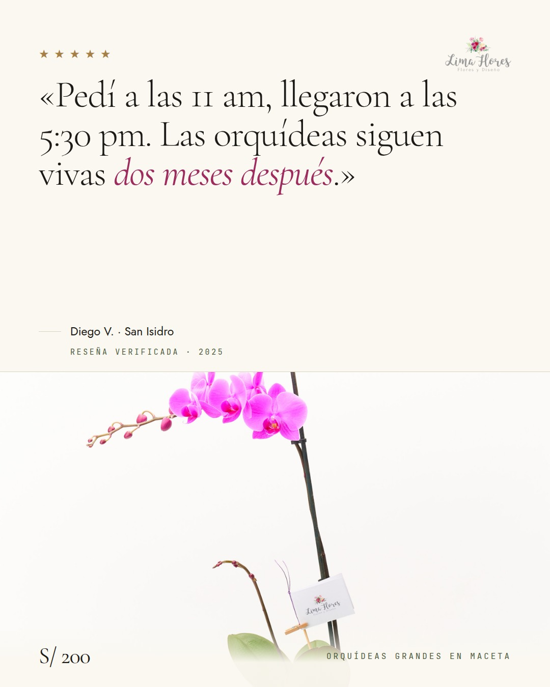

- **Objetivo** Ventas (conversión) · **Etapa** Consideración / Retargeting 30 días
- **Ubicación** Feed de Instagram · 4:5 (1080×1350)
- **Botón** Comprar

**Texto principal**

> «Las orquídeas siguen vivas dos meses después. Recomiendo cerrado los ojos.»
>
> — Diego V., San Isidro · reseña verificada
>
> Eso es exactamente lo que vendemos: algo que sigue vivo cuando ya nadie se acuerda del regalo.
>
> Phalaenopsis en maceta decorativa, con tarjeta e instrucciones de cuidado.

**Titular** «Siguen vivas dos meses después»

**Descripción** Orquídeas en maceta · S/200

**Hashtags** #limaflores #orquideas #reseñasreales #deliverylima

**Por qué funciona** Prueba social textual del propio sitio. Cubre la objeción que de verdad frena la compra de una planta como regalo: que se muera a la semana.

### IG-06 · Cuando el ramo no alcanza

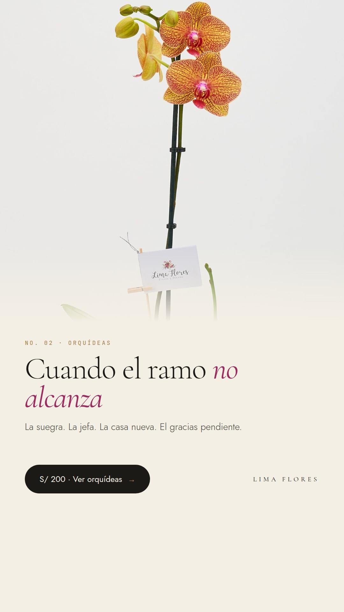

- **Objetivo** Ventas (conversión) · **Etapa** Retargeting caliente
- **Ubicación** Historias y Reels · 9:16 (1080×1920)
- **Botón** Comprar

**Texto principal**

> Para la suegra. Para la jefa. Para la casa nueva. Para el gracias que se te quedó pendiente hace tres semanas.
>
> Orquídea Phalaenopsis en maceta, entregada el día y la hora que elijas.

**Titular** Cuando el ramo no alcanza

**Descripción** S/200 · eliges día y hora

**Hashtags** #limaflores #orquideas #regalosperu

**Por qué funciona** Lista de ocasiones: deja que la persona se reconozca en una de las cuatro en menos de dos segundos.

---

## 03 · Ramo de flores Sofía — S/160

**Categoría** Ramos · **Ángulo** Anti–rosas rojas: criterio estético a precio de entrada, armado a mano.

**Público** 22–40, Lima Metropolitana. Público de entrada de precio y gusto estético: diseño, arquitectura, café de especialidad, decoración. Primer contacto con la marca.

**Destino** `/producto.html?id=ramo-de-flores-sofia`

### IG-07 · No mandes rosas rojas

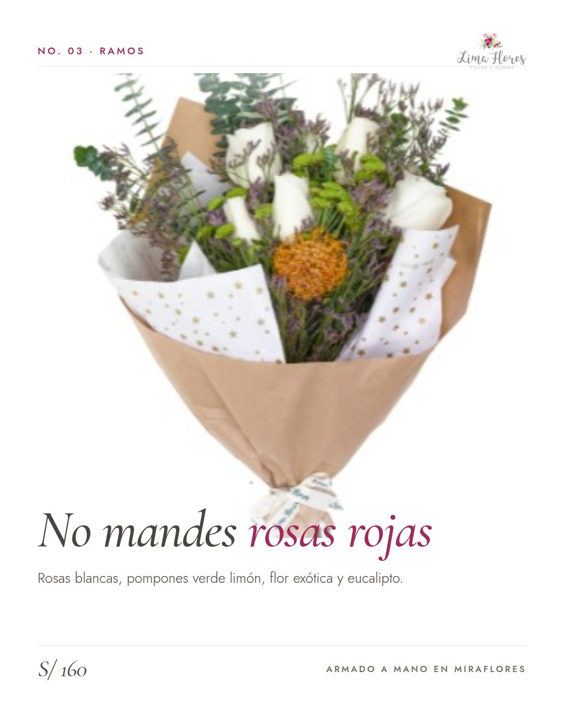

- **Objetivo** Reconocimiento / Tráfico · **Etapa** Frío
- **Ubicación** Feed y Explorar de Instagram · 4:5 (1080×1350)
- **Botón** Comprar

**Texto principal**

> Doce rosas rojas dicen «pasé por el mercado camino a tu casa».
>
> Rosas blancas, pompones verde limón, una flor exótica amarilla y eucalipto dicen «me senté a pensar en ti».
>
> El mismo gesto, cuesta menos, se nota más.
>
> Ramo Sofía, armado a mano en el atelier de Miraflores.

**Titular** No mandes rosas rojas

**Descripción** Ramo Sofía · hecho a mano · S/160

**Hashtags** #limaflores #ramosdeflores #floreslima #eucalipto #miraflores #regalosperu

**Por qué funciona** Gancho negativo contra el default de la categoría. Alto CTR en frío porque contradice lo que la gente iba a hacer igual.

### IG-08 · Nadie arma dos iguales

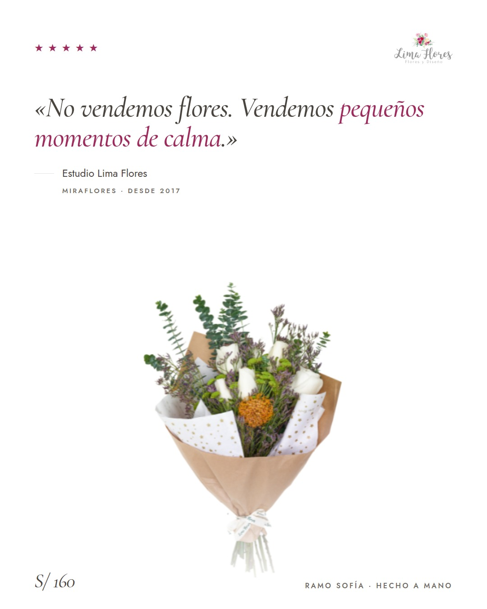

- **Objetivo** Tráfico / Interacción · **Etapa** Frío — marca
- **Ubicación** Feed de Instagram · 4:5 (1080×1350)
- **Botón** Más información

**Texto principal**

> No tenemos stock. Recibimos flores frescas lunes, miércoles y viernes, y cuando pides un ramo alguien se sienta, mira lo que llegó esa mañana y te lo arma.
>
> Por eso ningún Sofía sale idéntico al de la foto. Y por eso ninguno se parece a los de la tienda de la esquina.
>
> Atelier en Miraflores desde 2017.

**Titular** Nadie arma dos iguales

**Descripción** Desde S/160 · hecho a mano

**Hashtags** #limaflores #hechoamano #atelierfloral #miraflores #floreslima

**Por qué funciona** Anuncio de marca para alimentar los públicos de retargeting de IG-07 e IG-09 a CPM bajo. Es el manifiesto del propio sitio, sin cambiarle una palabra.

### IG-09 · Cuatro cosas difíciles de decir

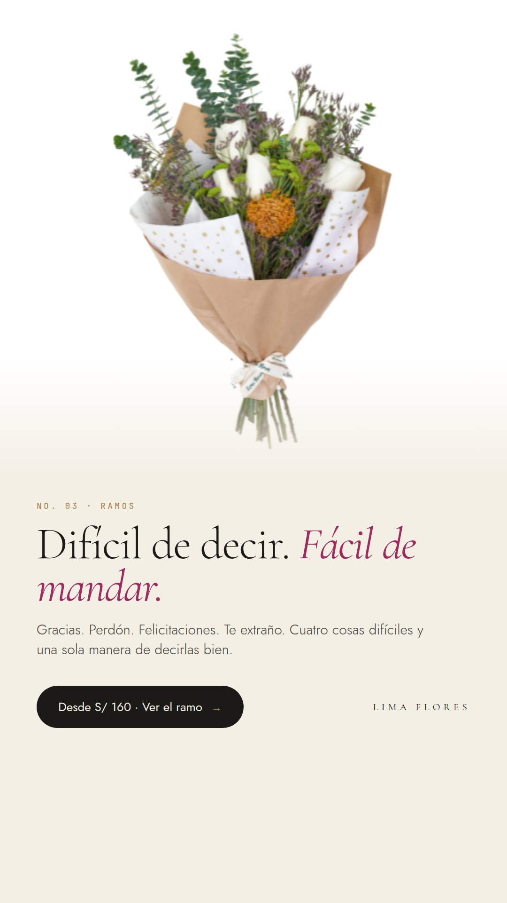

- **Objetivo** Ventas (conversión) · **Etapa** Retargeting caliente
- **Ubicación** Historias y Reels · 9:16 (1080×1920)
- **Botón** Comprar

**Texto principal**

> Gracias. Perdón. Felicitaciones. Te extraño.
>
> Cuatro cosas difíciles de decir y una sola manera de decirlas bien. Ramo Sofía, hecho a mano, entregado el día que elijas.

**Titular** Difícil de decir. Fácil de mandar.

**Descripción** Desde S/160 · eliges día y hora

**Hashtags** #limaflores #floreslima #deliverylima

**Por qué funciona** El texto hace el trabajo de segmentación solo: cada línea es una intención de compra distinta y el clic revela cuál.

---

## 04 · Arreglo Rossie — S/245

**Categoría** Arreglos · **Ángulo** Es el producto caro del set: se vende presencia y tamaño (30×50 cm), no cantidad de tallos.

**Público** 28–50, Lima Metropolitana. Momentos de ticket alto: aniversario, San Valentín, reconciliaciones, pedidas de mano. Excluir compradores de los últimos 30 días.

**Destino** `/producto.html?id=arreglo-rossie`

### IG-10 · Rojo de verdad

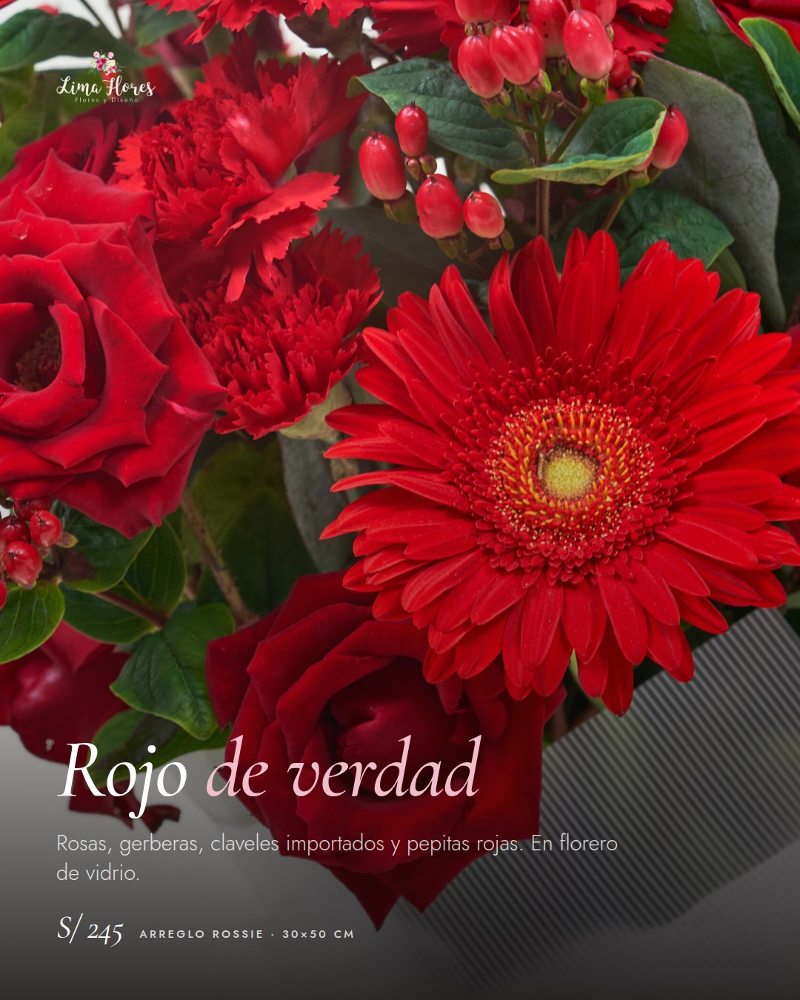

- **Objetivo** Reconocimiento / Tráfico · **Etapa** Frío
- **Ubicación** Feed y Explorar de Instagram · 4:5 (1080×1350)
- **Botón** Comprar

**Texto principal**

> Hay un rojo de supermercado y hay este.
>
> Rosas, gerberas, claveles importados y pepitas rojas apretadas hasta que no entra una flor más, en florero de vidrio.
>
> Mide 50 cm de alto y ocupa la mesa entera. S/245, el día y la hora que elijas.

**Titular** Rojo de verdad

**Descripción** Arreglo Rossie · 30×50 cm · S/245

**Hashtags** #limaflores #floreslima #rosasrojas #aniversario #deliverylima

**Por qué funciona** Foto a sangre y una sola frase: en el feed compite con imagen, no con texto. El macro del arreglo es lo más fuerte que tiene el catálogo.

### IG-11 · Ocupa la mesa entera

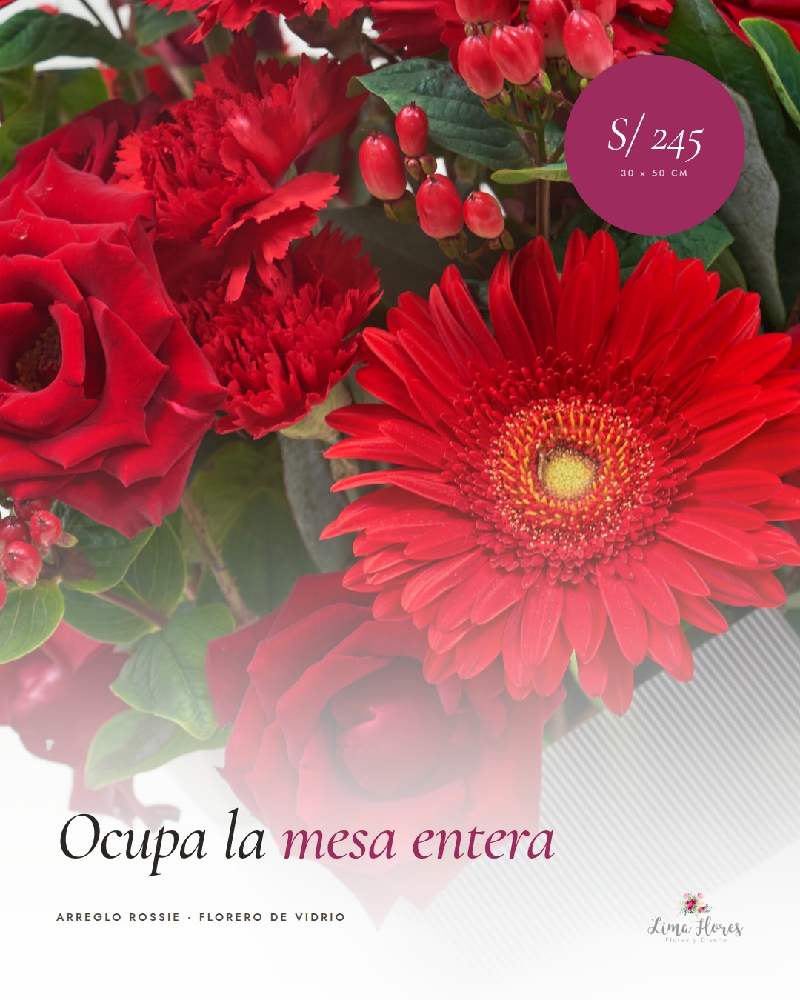

- **Objetivo** Ventas (conversión) · **Etapa** Consideración / Retargeting 14 días
- **Ubicación** Feed de Instagram · 4:5 (1080×1350)
- **Botón** Comprar

**Texto principal**

> 30 cm de ancho por 50 de alto.
>
> No es el detalle que se pone al costado del plato: es lo primero que ve cuando entra a la casa.
>
> Rosas, gerberas y claveles importados en florero de vidrio, armado a mano. S/245.

**Titular** Mide 50 cm. Se nota.

**Descripción** Florero de vidrio incluido · S/245

**Hashtags** #limaflores #arreglosflorales #floreslima #regalosperu

**Por qué funciona** El sello de precio hace el trabajo del texto: quien ya vio el producto necesita el número, no otro párrafo. La medida en el sello responde la pregunta real, que es el tamaño.

### IG-12 · Cuando bonito no alcanza

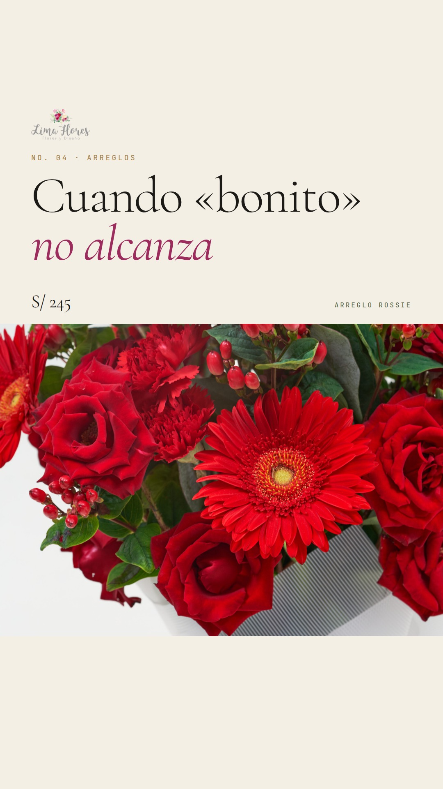

- **Objetivo** Ventas (conversión) · **Etapa** Retargeting caliente
- **Ubicación** Historias y Reels · 9:16 (1080×1920)
- **Botón** Comprar

**Texto principal**

> Aniversarios, disculpas grandes, sí definitivos.
>
> Hay momentos en los que un ramo correcto no dice lo suficiente. Para eso está el Rossie: rojo cerrado, 50 cm, florero de vidrio incluido.
>
> S/245, en Lima Metropolitana.

**Titular** Cuando «bonito» no alcanza

**Descripción** Arreglo Rossie · S/245

**Hashtags** #limaflores #aniversario #floreslima

**Por qué funciona** Invierte la jerarquía: el texto es el creativo y la foto entra como franja. Rompe el patrón visual de las otras historias en el mismo feed.

---

## 05 · Tulipanes de amor — S/195

**Categoría** Floreros · **Ángulo** Personalización: es el único del set donde el cliente elige el color.

**Público** 25–45, Lima Metropolitana. Regalo de cumpleaños y de pareja. Buen público para públicos similares al 1% de compradores de Floreros.

**Destino** `/producto.html?id=tulipanes-de-amor`

### IG-13 · Tú eliges el color

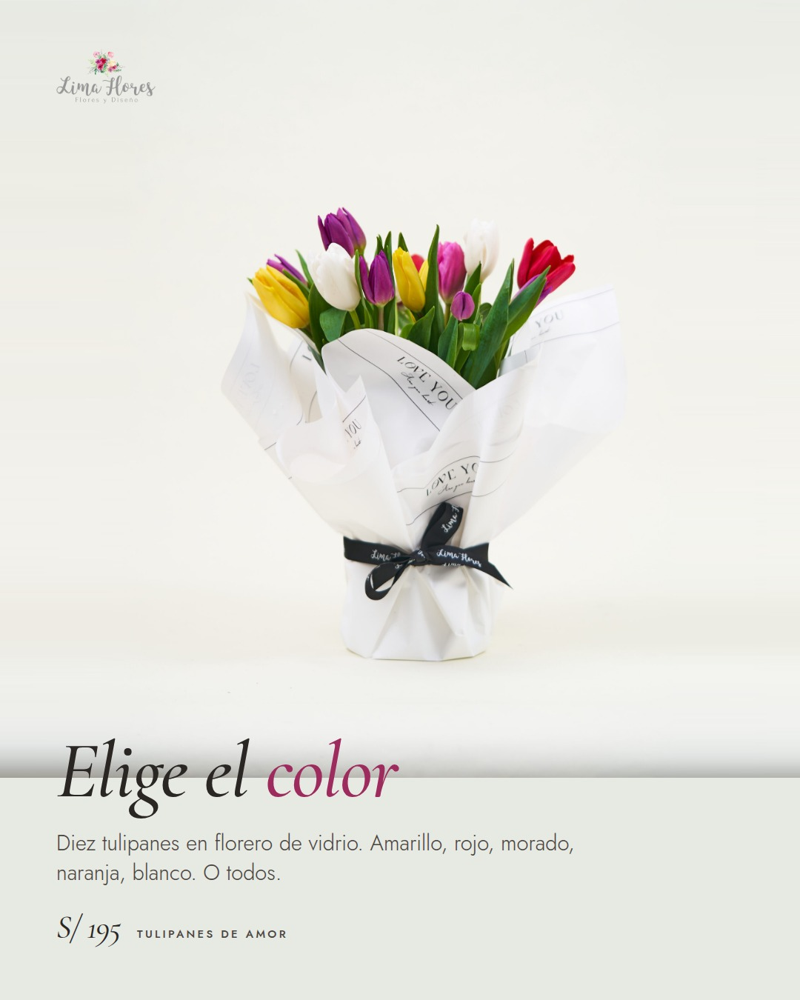

- **Objetivo** Ventas (conversión) · **Etapa** Frío
- **Ubicación** Feed y Explorar de Instagram · 4:5 (1080×1350)
- **Botón** Comprar

**Texto principal**

> Diez tulipanes en florero de vidrio. Tú eliges: amarillo, rojo, morado, naranja, blanco, o el mix de todos como en la foto.
>
> Viene con papel decorativo y tarjeta de dedicatoria. S/195, el día y la hora que elijas.

**Titular** Tú eliges el color

**Descripción** 10 tulipanes · florero incluido · S/195

**Hashtags** #limaflores #tulipanes #floreslima #regalosperu #deliverylima

**Por qué funciona** La foto ya tiene el aire arriba: el texto se apoya en el fondo crema sin recuadros ni velos. Es el formato más limpio del set y el que mejor pasa por publicación orgánica.

### IG-14 · Nada de stock

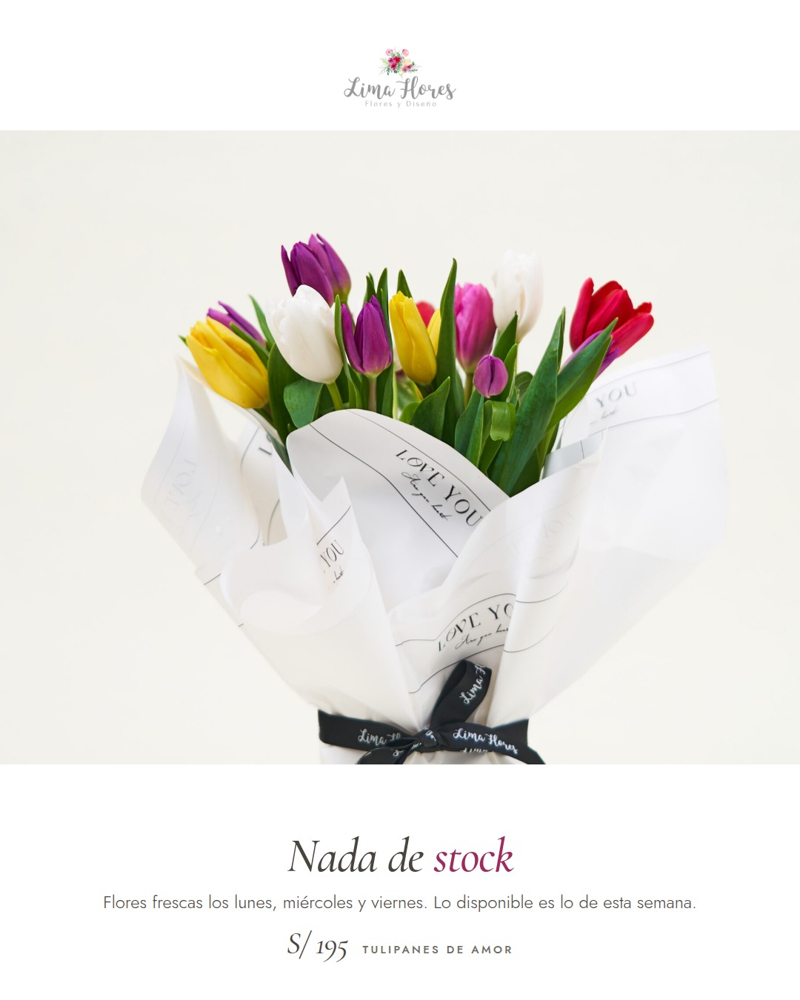

- **Objetivo** Tráfico / Interacción · **Etapa** Frío — marca
- **Ubicación** Feed de Instagram · 4:5 (1080×1350)
- **Botón** Más información

**Texto principal**

> No tenemos stock. Recibimos flores frescas los lunes, miércoles y viernes, y lo que está disponible es lo que llegó esa semana.
>
> Si algo se acaba, te avisamos en menos de una hora.
>
> Diez tulipanes en florero de vidrio, con papel decorativo y tarjeta de dedicatoria. S/195.

**Titular** Nada de stock

**Descripción** Tulipanes de amor · florero incluido · S/195

**Hashtags** #limaflores #tulipanes #atelierfloral #floreslima

**Por qué funciona** Es el manifiesto de la propia landing, sin cambiarle una palabra. Explica por qué el catálogo cambia y convierte esa limitación en argumento.

### IG-15 · Elige el color, llega hoy

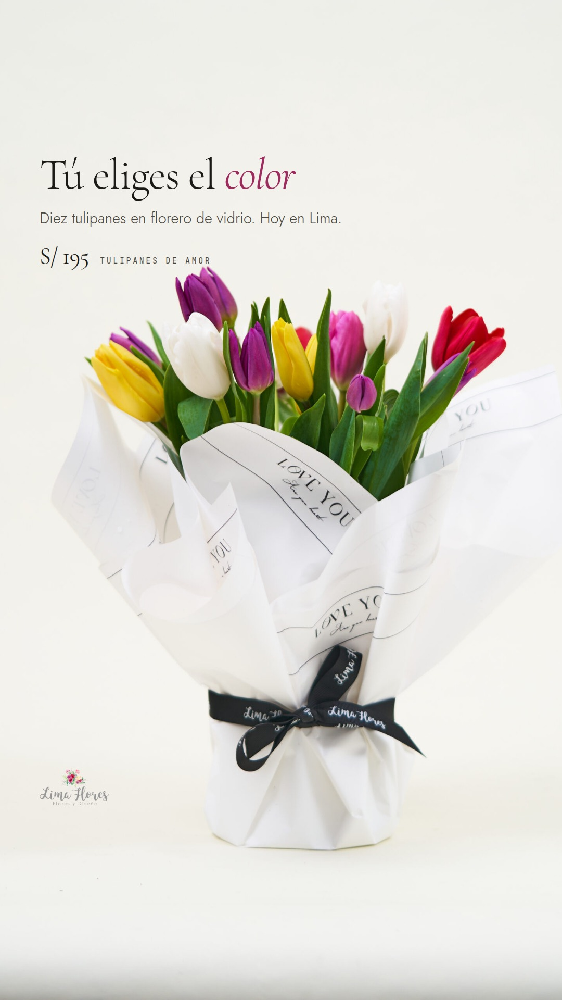

- **Objetivo** Ventas (conversión) · **Etapa** Retargeting caliente
- **Ubicación** Historias y Reels · 9:16 (1080×1920)
- **Botón** Comprar

**Texto principal**

> Amarillo, rojo, morado, naranja o blanco.
>
> Diez tulipanes en florero de vidrio. Eliges el color, el día y la hora. Desliza y arma el tuyo.

**Titular** Elige el color y el día

**Descripción** S/195 · eliges día y hora

**Hashtags** #limaflores #tulipanes #deliverylima

**Por qué funciona** Mismo formato limpio que IG-13 en vertical, para medir si el gancho del color rinde igual en historias que en feed sin cambiar nada más.

---

## 06 · Ramo Luana — S/180

**Categoría** Ramos · **Ángulo** La foto está tomada en una sala y no en un fondo blanco: se vende cercanía.

**Público** 22–40, Lima Metropolitana. Primera compra, regalo casual entre amigas, mudanzas y agradecimientos. Público frío amplio.

**Destino** `/producto.html?id=ramo-luana`

### IG-16 · Para una sala de verdad

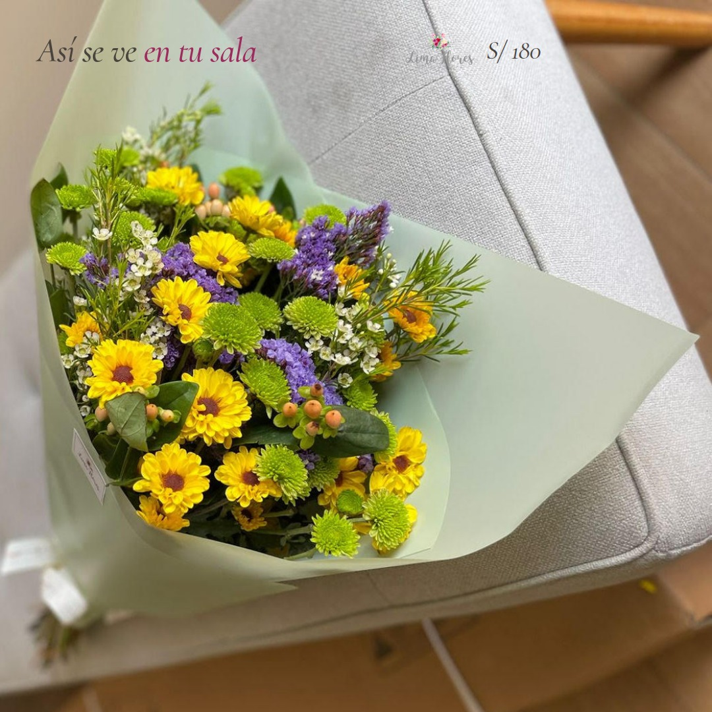

- **Objetivo** Reconocimiento / Tráfico · **Etapa** Frío
- **Ubicación** Feed de Instagram · 1:1 (1080×1080)
- **Botón** Comprar

**Texto principal**

> Mini rosas naranjas, siemprevivas moradas, pompones verdes y toques amarillos, con follaje verde.
>
> Un ramo para una sala de verdad, no para una vitrina. S/180, armado a mano en el atelier de Miraflores.

**Titular** Para una sala de verdad

**Descripción** Ramo Luana · S/180

**Hashtags** #limaflores #ramosdeflores #floreslima #hechoamano #miraflores

**Por qué funciona** La foto está tomada en una sala y no en un fondo blanco: en el feed no parece anuncio, que es justo lo que conviene en público frío amplio.

### IG-17 · Para la amiga que se mudó

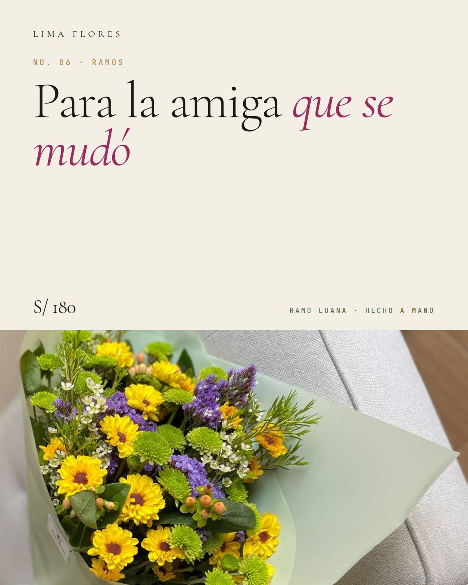

- **Objetivo** Tráfico · **Etapa** Frío
- **Ubicación** Feed y Explorar de Instagram · 4:5 (1080×1350)
- **Botón** Más información

**Texto principal**

> No todo regalo tiene que ser un acontecimiento.
>
> Este es para la amiga que se mudó, para la casa de tu mamá, para el jueves en que alguien la pasó mal.
>
> Mini rosas naranjas, siemprevivas moradas y pompones verdes, armado a mano. S/180.

**Titular** Para la amiga que se mudó

**Descripción** Ramo Luana · hecho a mano · S/180

**Hashtags** #limaflores #ramosdeflores #regalosconsentido #floreslima

**Por qué funciona** Nombra una ocasión chica y concreta en vez de una fecha del calendario: vende en los diez meses del año en que no hay campaña.

### IG-18 · Los colores que nadie pide

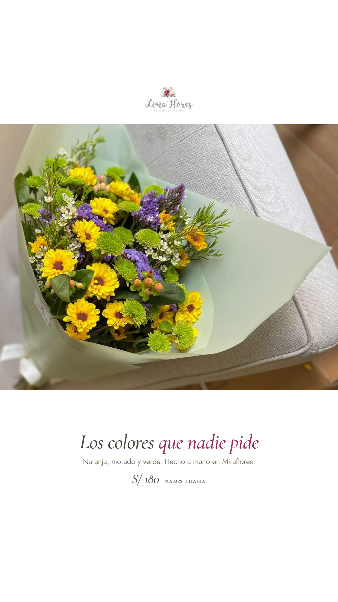

- **Objetivo** Ventas (conversión) · **Etapa** Retargeting caliente
- **Ubicación** Historias y Reels · 9:16 (1080×1920)
- **Botón** Comprar

**Texto principal**

> Naranjas, morados y verdes en el mismo ramo: los colores que nadie pide y todos miran.
>
> Hecho a mano en el atelier de Miraflores, entregado el día que elijas. S/180.

**Titular** Los colores que nadie pide

**Descripción** Ramo Luana · S/180

**Hashtags** #limaflores #floreslima #deliverylima

**Por qué funciona** El marco de postal separa el producto del fondo del feed y da aire: funciona bien cuando la foto es de celular y no aguanta ir a sangre en vertical.

---

## 07 · Box Chococafé — S/220

**Categoría** Arreglos · **Ángulo** No compite con otras flores: compite con el regalo que la persona iba a comprar en vez de flores.

**Público** 28–50, Lima Metropolitana. Regalo corporativo, cumpleaños y Día de la Madre. Intereses: café de especialidad, repostería, regalos.

**Destino** `/producto.html?id=box-chococafe`

### IG-19 · Flores y café en la misma caja

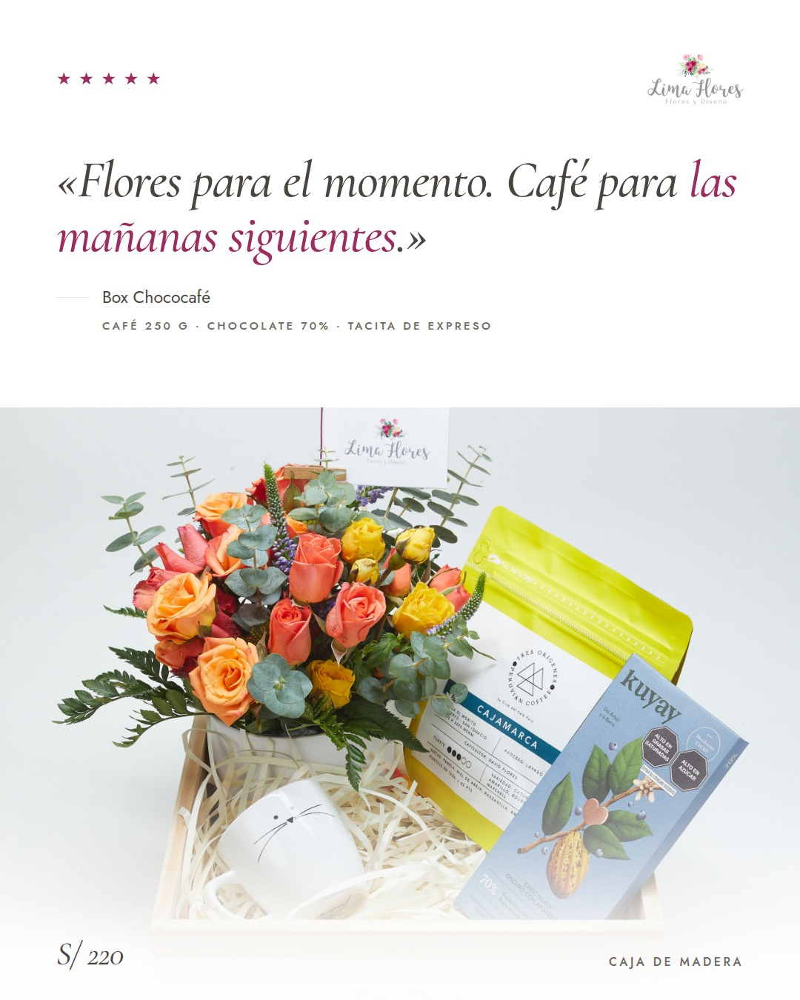

- **Objetivo** Ventas (conversión) · **Etapa** Frío
- **Ubicación** Feed y Explorar de Instagram · 4:5 (1080×1350)
- **Botón** Comprar

**Texto principal**

> Flores para el momento. Café para las mañanas siguientes.
>
> El Box Chococafé trae mini rosas con follaje verde, café de especialidad de 250 g, chocolate al 70% con arándanos y una tacita de expreso, en caja de madera.
>
> S/220. Eliges el día y la hora de entrega.

**Titular** Flores, café y chocolate

**Descripción** Box Chococafé · caja de madera · S/220

**Hashtags** #limaflores #regalosperu #cafedeespecialidad #floreslima #miraflores

**Por qué funciona** No compite con otras flores: compite con el regalo que la persona iba a comprar en vez de flores.

---

## 08 · Orquídea Sunrise de dos varas — S/215

**Categoría** Orquídeas · **Ángulo** Dos varas en vez de una: es el detalle que justifica el precio frente a la orquídea del supermercado.

**Público** 30–55, Lima Metropolitana. Día de la Madre, agradecimientos y casa nueva. Retargeting de la categoría Orquídeas.

**Destino** `/producto.html?id=orquidea-sunrise-de-dos-varas`

### IG-20 · Dos varas, no una

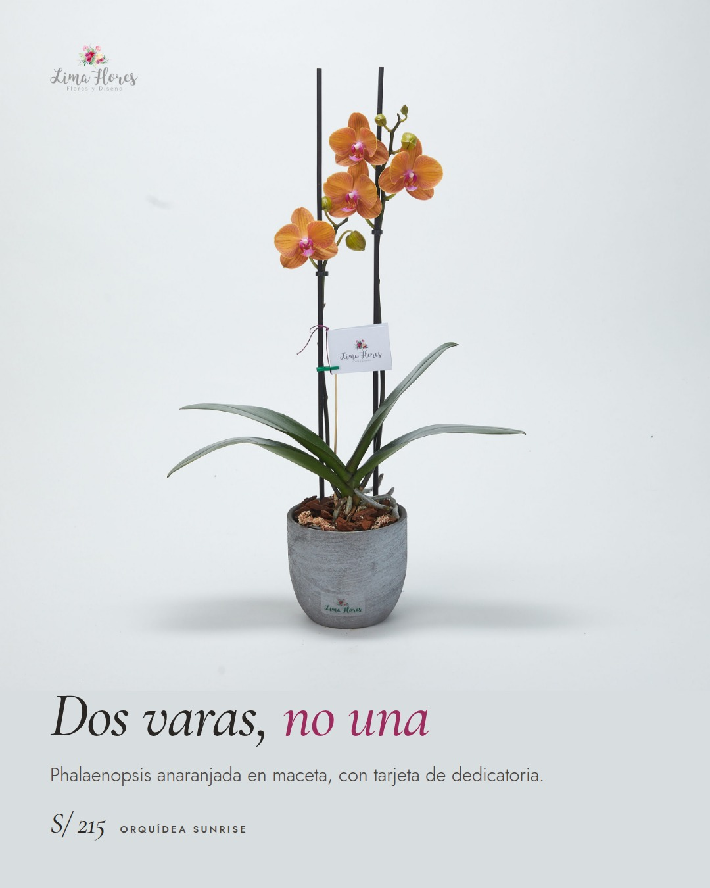

- **Objetivo** Reconocimiento / Tráfico · **Etapa** Frío
- **Ubicación** Feed y Explorar de Instagram · 4:5 (1080×1350)
- **Botón** Comprar

**Texto principal**

> Dos varas, no una.
>
> Phalaenopsis anaranjada en maceta, con tarjeta de dedicatoria. Armada a mano en el atelier de Miraflores.
>
> S/215, el día y la hora que elijas.

**Titular** Dos varas, no una

**Descripción** Phalaenopsis anaranjada · S/215

**Hashtags** #limaflores #orquideas #phalaenopsis #regalosperu #plantaslima

**Por qué funciona** Dos varas en vez de una: es el detalle que justifica el precio frente a la orquídea del supermercado.

---

## 09 · BOX Sensación — S/225

**Categoría** Arreglos · **Ángulo** Prueba social: la reseña hace el trabajo que el copy de producto no puede hacer solo.

**Público** 25–45, Lima Metropolitana. Cumpleaños y celebraciones. Público similar al 1% de compradores de Arreglos.

**Destino** `/producto.html?id=box-sensacion`

### IG-21 · Como para una portada

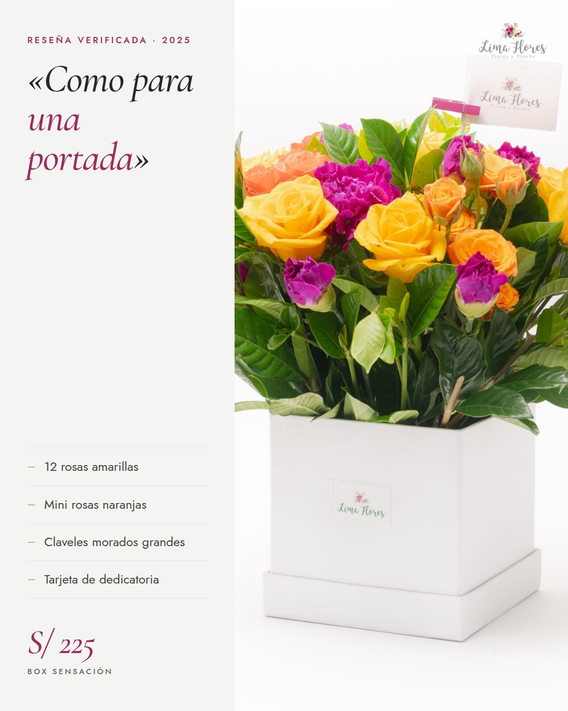

- **Objetivo** Ventas (conversión) · **Etapa** Consideración / Retargeting 30 días
- **Ubicación** Feed de Instagram · 4:5 (1080×1350)
- **Botón** Comprar

**Texto principal**

> «El ramo llegó armado como si fuera para una portada de revista. Mi mamá lloró cuando lo vio. No se les escapa un solo detalle.»
>
> — Camila R., Surco · reseña verificada
>
> Box Sensación: 12 rosas amarillas con mini rosas naranjas, claveles morados grandes y follaje verde. Incluye tarjeta de dedicatoria.
>
> S/225, el día y la hora que elijas.

**Titular** «Como para una portada de revista»

**Descripción** Box Sensación · 12 rosas amarillas · S/225

**Hashtags** #limaflores #arreglosflorales #floreslima #rosasamarillas

**Por qué funciona** Prueba social: la reseña hace el trabajo que el copy de producto no puede hacer solo.

---

## 10 · Arreglo Andrea — S/165

**Categoría** Arreglos · **Ángulo** Es el ticket más bajo del set: entra por precio y por tamaño de mesa, no por ocasión.

**Público** 22–40, Lima Metropolitana. Precio de entrada, primera compra y regalo de oficina. Público frío amplio.

**Destino** `/producto.html?id=arreglo-andrea`

### IG-22 · Naranja sobre loza blanca

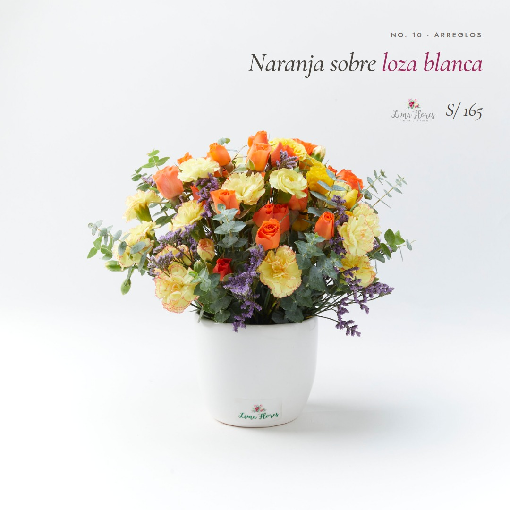

- **Objetivo** Tráfico · **Etapa** Frío
- **Ubicación** Feed de Instagram · 1:1 (1080×1080)
- **Botón** Comprar

**Texto principal**

> Mini rosas anaranjadas, claveles, toques morados y follaje verde, en contenedor de loza blanca.
>
> Del tamaño que cabe en una mesa sin tapar a nadie. S/165, armado a mano en el atelier de Miraflores.

**Titular** Mini rosas naranjas en loza blanca

**Descripción** Arreglo Andrea · S/165

**Hashtags** #limaflores #arreglosflorales #floreslima #regalosconsentido

**Por qué funciona** Es el ticket más bajo del set: entra por precio y por tamaño de mesa, no por ocasión.

---

## 11 · Orquídeas amarillas con líneas fucsias — S/215

**Categoría** Orquídeas · **Ángulo** Ataca el default de la categoría, que es la Phalaenopsis blanca. El color es todo el argumento.

**Público** 30–55, Lima Metropolitana. Regalo de diseño y decoración. Retargeting de visitantes de Orquídeas.

**Destino** `/producto.html?id=orquideas-amarillas-con-lineas-fucsias`

### IG-23 · No es la orquídea blanca

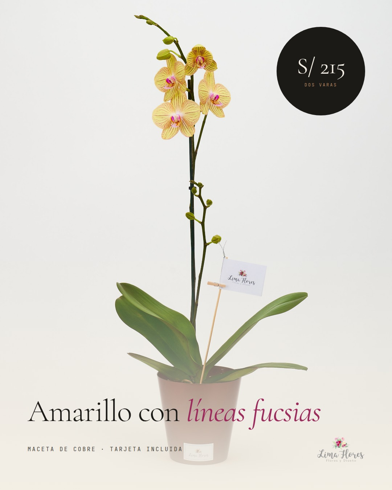

- **Objetivo** Ventas (conversión) · **Etapa** Consideración / Retargeting 30 días
- **Ubicación** Feed de Instagram · 4:5 (1080×1350)
- **Botón** Comprar

**Texto principal**

> Amarillo de fondo, líneas y centro fucsia, dos varas, maceta de cobre.
>
> No es la Phalaenopsis blanca de siempre. Incluye tarjeta de dedicatoria.
>
> S/215, el día y la hora que elijas.

**Titular** No es la orquídea blanca de siempre

**Descripción** Phalaenopsis de dos varas · S/215

**Hashtags** #limaflores #orquideas #phalaenopsis #decoracion #regalosperu

**Por qué funciona** Ataca el default de la categoría, que es la Phalaenopsis blanca. El color es todo el argumento.

---

## 12 · Ramo de rosas con papel de estrellas — S/190

**Categoría** Ramos · **Ángulo** La cantidad es el gancho: veinticuatro contra las doce de todo el mercado, y a S/190.

**Público** 25–45, Lima Metropolitana. Aniversario, San Valentín y pedidas. Excluir compradores de 30 días.

**Destino** `/producto.html?id=ramo-de-24-rosas-con-papel-de-estrellas`

### IG-24 · Veinticuatro, no doce

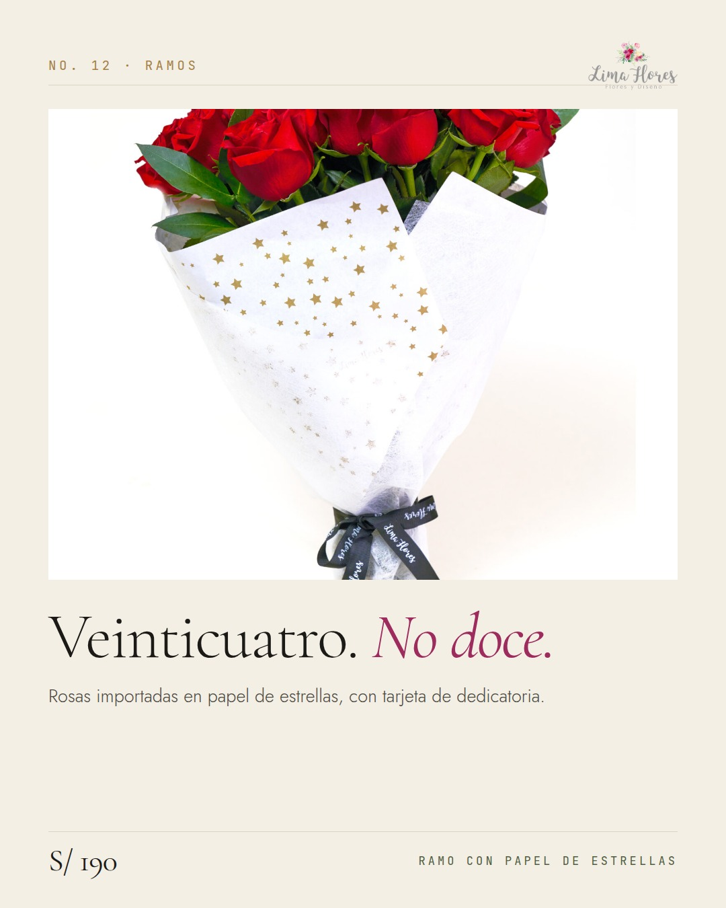

- **Objetivo** Ventas (conversión) · **Etapa** Frío
- **Ubicación** Feed y Explorar de Instagram · 4:5 (1080×1350)
- **Botón** Comprar

**Texto principal**

> Veinticuatro rosas importadas, no doce.
>
> Envueltas en papel de estrellas, con tarjeta de dedicatoria.
>
> S/190, el día y la hora que elijas.

**Titular** Veinticuatro, no doce

**Descripción** 24 rosas importadas · S/190

**Hashtags** #limaflores #rosas #ramosdeflores #aniversario #floreslima

**Por qué funciona** La cantidad es el gancho: veinticuatro contra las doce de todo el mercado, y a S/190.

---

## 13 · Orquídea Rosado Vintage — S/200

**Categoría** Orquídeas · **Ángulo** Formato postal: la orquídea se vende como objeto de decoración, no como ramo.

**Público** 28–50, Lima Metropolitana. Regalo de decoración y agradecimiento. Intereses: interiorismo, plantas.

**Destino** `/producto.html?id=orquidea-rosado-vintage`

### IG-25 · Rosado vintage

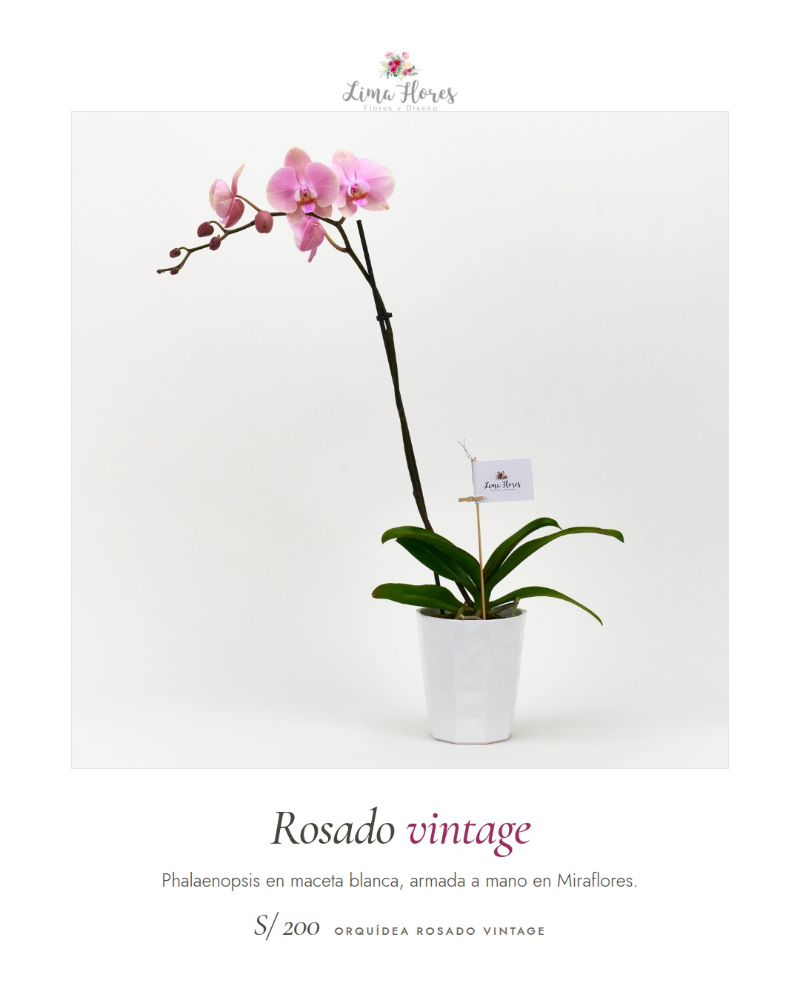

- **Objetivo** Tráfico / Interacción · **Etapa** Frío — marca
- **Ubicación** Feed de Instagram · 4:5 (1080×1350)
- **Botón** Más información

**Texto principal**

> Una Phalaenopsis rosado vintage en maceta blanca.
>
> No se pone en la mesa del comedor un domingo: se queda en la casa.
>
> S/200, armada a mano en el atelier de Miraflores.

**Titular** Se queda en la casa

**Descripción** Orquídea Rosado Vintage · S/200

**Hashtags** #limaflores #orquideas #interiorismo #plantaslima

**Por qué funciona** Formato postal: la orquídea se vende como objeto de decoración, no como ramo.

---

## 14 · BOX SIMONA — S/176

**Categoría** Arreglos · **Ángulo** Ticket bajo en historia: el formato vertical con botón es el que mejor cierra en retargeting.

**Público** 22–45, Lima Metropolitana. Retargeting caliente de visitantes de Arreglos y carritos abandonados.

**Destino** `/producto.html?id=box-simona`

### IG-26 · Amarillas y lilas

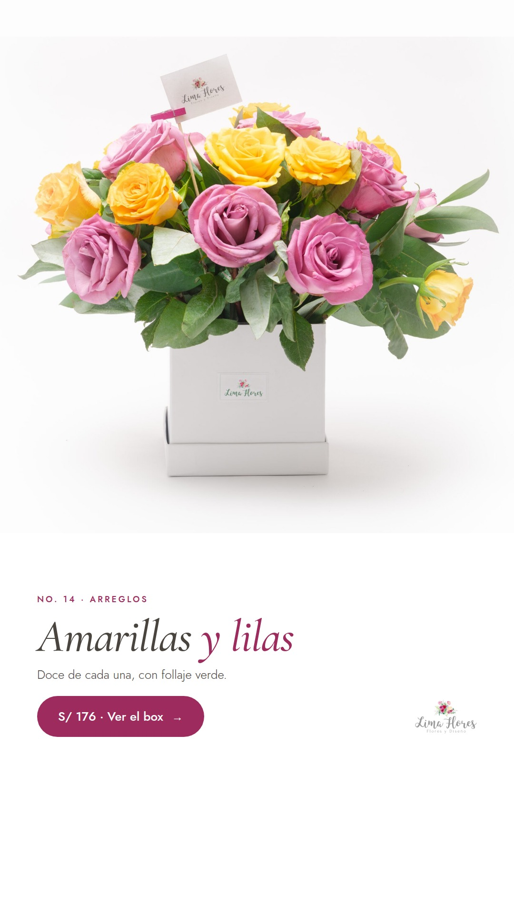

- **Objetivo** Ventas (conversión) · **Etapa** Retargeting caliente
- **Ubicación** Historias y Reels · 9:16 (1080×1920)
- **Botón** Comprar

**Texto principal**

> Doce rosas amarillas y doce lilas, con follaje verde.
>
> El arreglo más completo por debajo de S/180. Eliges el día y la hora de entrega.

**Titular** 24 rosas por S/176

**Descripción** Box Simona · amarillas y lilas

**Hashtags** #limaflores #arreglosflorales #floreslima

**Por qué funciona** Ticket bajo en historia: el formato vertical con botón es el que mejor cierra en retargeting.

---

## 15 · Florero de 10 tulipanes — S/195

**Categoría** Floreros · **Ángulo** Los tulipanes son el producto con más color del catálogo: en historia, el creativo se ve desde lejos.

**Público** 25–45, Lima Metropolitana. Regalo de pareja y cumpleaños. Público similar al 1% de compradores de Floreros.

**Destino** `/producto.html?id=florero-de-10-tulipanes-2`

### IG-27 · Mix o un solo color

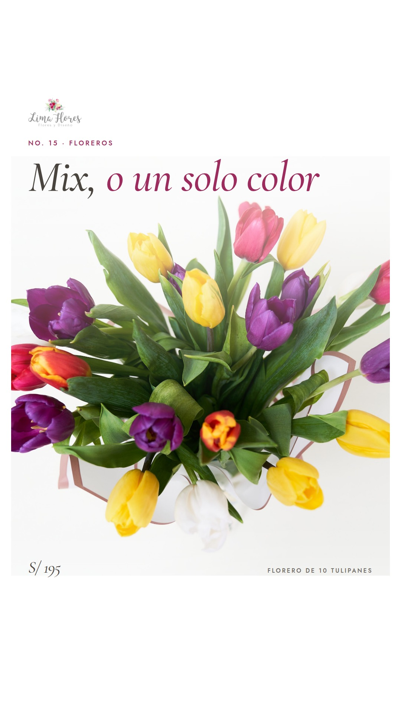

- **Objetivo** Ventas (conversión) · **Etapa** Frío
- **Ubicación** Historias y Reels · 9:16 (1080×1920)
- **Botón** Comprar

**Texto principal**

> Mix de colores, o uno solo: blanco, morado, anaranjado, rojo, fucsia o amarillo.
>
> Diez tulipanes en florero. Tú eliges el color, el día y la hora.
>
> S/195.

**Titular** Mix, o un solo color

**Descripción** 10 tulipanes en florero · S/195

**Hashtags** #limaflores #tulipanes #floreslima #deliverylima

**Por qué funciona** Los tulipanes son el producto con más color del catálogo: en historia, el creativo se ve desde lejos.

---

## 16 · Box Yani — S/180

**Categoría** Arreglos · **Ángulo** Flores más espumante: sube el ticket y sale de la categoría floral pura. Exige cumplimiento +18.

**Público** SOLO 25–50 y con segmentación +18 obligatoria. Lima Metropolitana. Aniversario y celebraciones.

**Destino** `/producto.html?id=box-yani`

### IG-28 · Flores y espumante

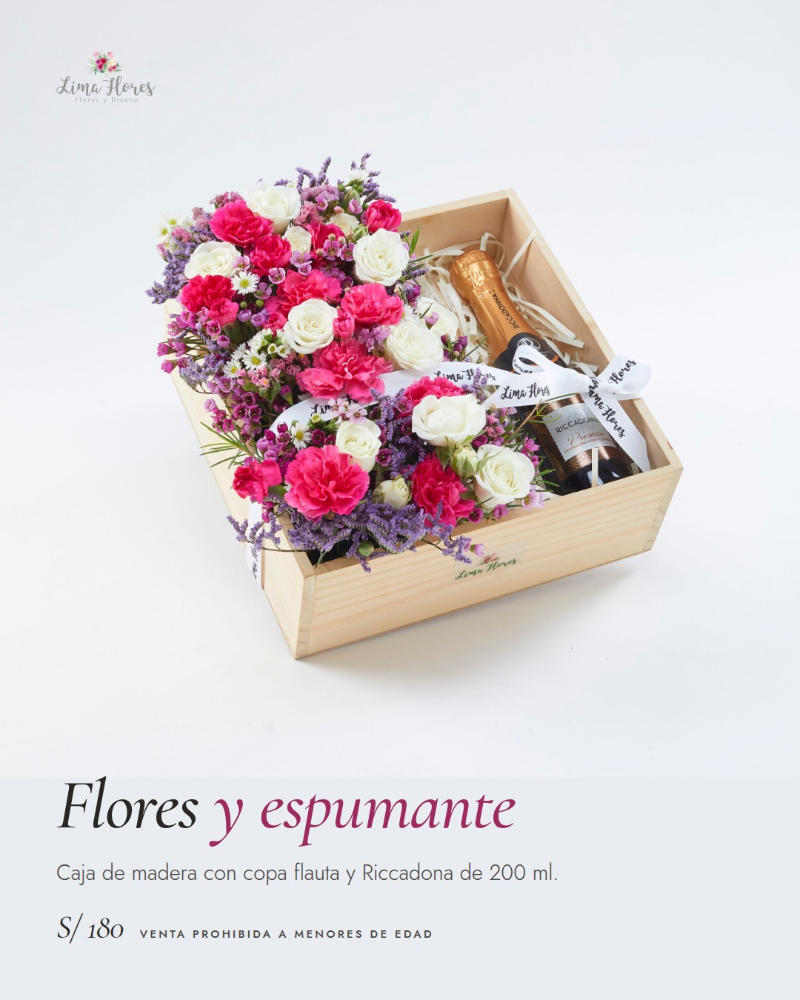

- **Objetivo** Ventas (conversión) · **Etapa** Frío · +18
- **Ubicación** Feed de Instagram · 4:5 (1080×1350) · segmentación +18 obligatoria
- **Botón** Comprar

**Texto principal**

> Mini rosas, claveles y toques morados en caja de madera, con una copa flauta de vidrio y una botella de Riccadona de 200 ml.
>
> S/180, el día y la hora que elijas.
>
> Prohibida la venta a menores de edad. Tomar bebidas alcohólicas en exceso es dañino.

**Titular** Flores y espumante en la misma caja

**Descripción** Box Yani · copa incluida · S/180

**Hashtags** #limaflores #regalosperu #aniversario #floreslima

**Por qué funciona** Flores más espumante: sube el ticket y sale de la categoría floral pura. Exige cumplimiento +18.

---

## 17 · Box Rogelia — S/210

**Categoría** Arreglos · **Ángulo** Veinticinco rosas contra la docena de todo el mercado, y el color se elige.

**Público** 28–50, Lima Metropolitana. Aniversario y San Valentín. Excluir compradores de 30 días.

**Destino** `/producto.html?id=box-rogelia`

### IG-29 · Veinticinco en caja negra

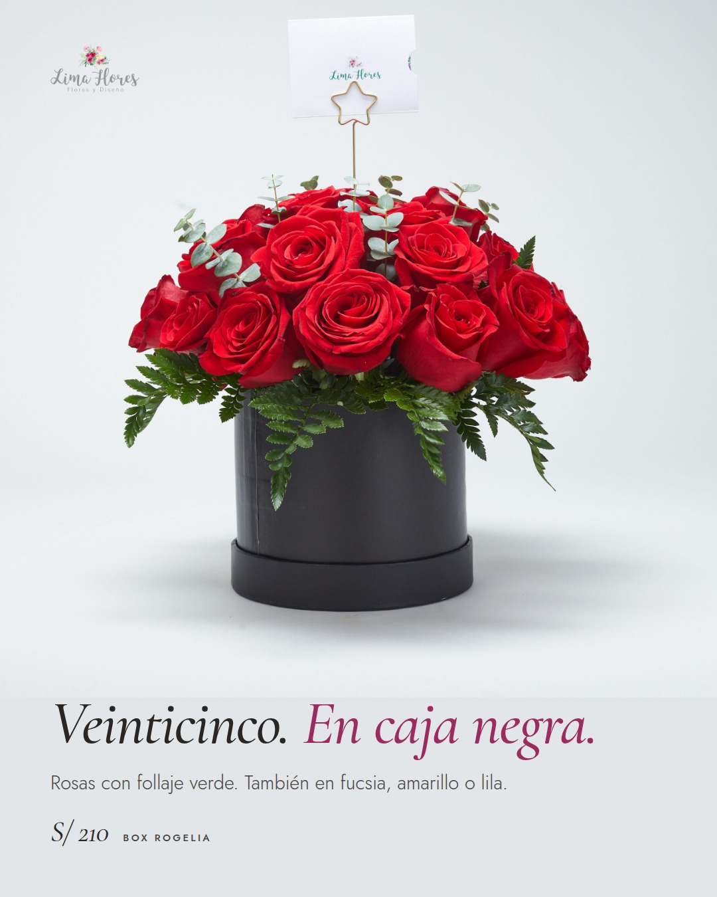

- **Objetivo** Ventas (conversión) · **Etapa** Frío
- **Ubicación** Feed y Explorar de Instagram · 4:5 (1080×1350)
- **Botón** Comprar

**Texto principal**

> Veinticinco rosas, no una docena.
>
> En caja negra con follaje verde. Y si el rojo no va, salen también en fucsia, amarillo o lila.
>
> S/210, el día y la hora que elijas.

**Titular** Veinticinco rosas en caja negra

**Descripción** Box Rogelia · 25 rosas · S/210

**Hashtags** #limaflores #rosasrojas #arreglosflorales #aniversario #floreslima

**Por qué funciona** Veinticinco rosas contra la docena de todo el mercado, y el color se elige.

---

## 18 · Boxsito Crespito — S/180

**Categoría** Arreglos · **Ángulo** Único del catálogo con peluche y globo: sale de la categoría floral y entra en la de regalo.

**Público** 22–45, Lima Metropolitana. Nacimientos, cumpleaños infantiles y regalos entre amigas.

**Destino** `/producto.html?id=boxsito-ramon`

### IG-30 · Con osito

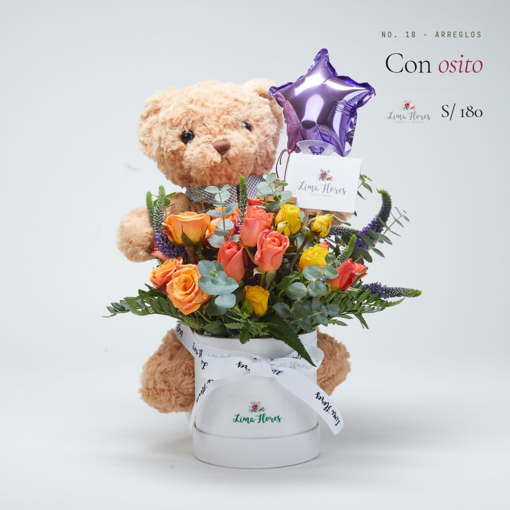

- **Objetivo** Reconocimiento / Tráfico · **Etapa** Frío
- **Ubicación** Feed de Instagram · 1:1 (1080×1080)
- **Botón** Comprar

**Texto principal**

> Mini rosas amarillas y naranjas con follaje verde, un globo de estrella morado y un osito de peluche.
>
> Para nacimientos, cumpleaños de niños y para quien se ríe de los regalos serios.
>
> S/180, el día y la hora que elijas.

**Titular** Flores con osito y globo

**Descripción** Boxsito Crespito · S/180

**Hashtags** #limaflores #regalosperu #nacimiento #cumpleaños #floreslima

**Por qué funciona** Único del catálogo con peluche y globo: sale de la categoría floral y entra en la de regalo.

### IG-37 · Osito, globo y mini rosas

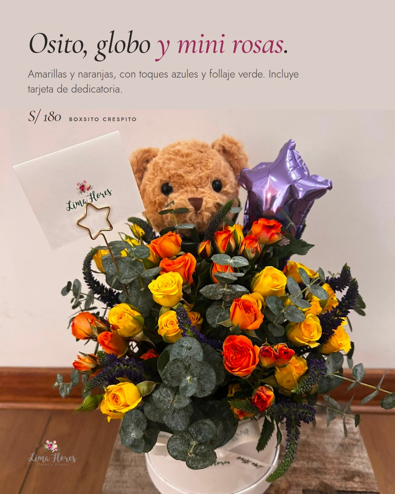

- **Objetivo** Ventas (conversión) · **Etapa** Frío
- **Ubicación** Feed de Instagram · 4:5 (1080×1350)
- **Botón** Comprar

**Texto principal**

> Osito con arreglo de mini rosas amarillas, naranjas y toques azules, follaje verde y un pequeño globo morado metálico.
>
> Incluye tarjeta de dedicatoria sin costo. S/180, entrega al día siguiente en Lima Metropolitana.

**Titular** Osito, globo y mini rosas

**Descripción** Boxsito Crespito · S/180

**Hashtags** #limaflores #regalos #cumpleaños #deliverylima

**Por qué funciona** Toma de la florería, no de estudio: el arreglo sobre el banco de madera se lee como un regalo que llega a una casa. El aire de la pared de arriba es el sitio del titular.

---

## 19 · Box Gaby Café — S/210

**Categoría** Arreglos · **Ángulo** Las dos tacitas cambian el destinatario: no es para una persona, es para una pareja.

**Público** 28–50, Lima Metropolitana. Aniversario y regalo de pareja. Intereses: café de especialidad.

**Destino** `/producto.html?id=box-gaby-cafe`

### IG-31 · Café para dos

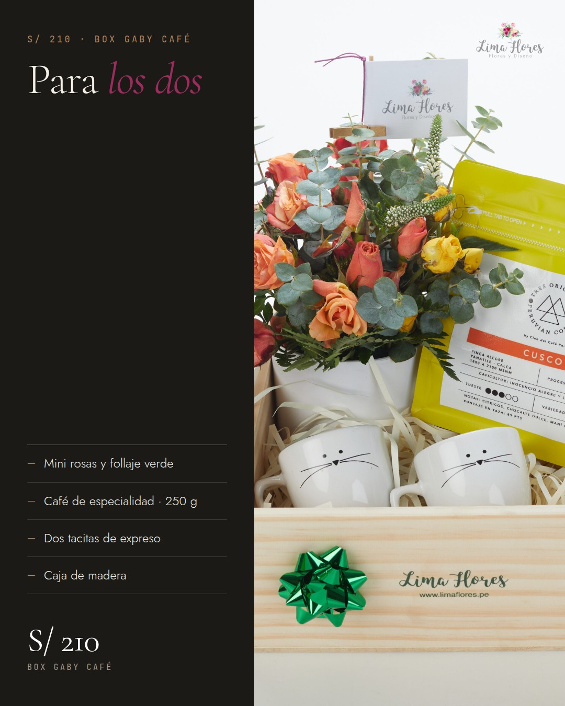

- **Objetivo** Ventas (conversión) · **Etapa** Consideración / Retargeting 14 días
- **Ubicación** Feed de Instagram · 4:5 (1080×1350)
- **Botón** Comprar

**Texto principal**

> Dos tacitas, no una.
>
> Mini rosas con follaje verde, café de especialidad de 250 gramos y dos tacitas de expreso, en caja de madera.
>
> S/210, el día y la hora que elijas.

**Titular** Café para dos, flores para la mesa

**Descripción** Box Gaby Café · dos tacitas · S/210

**Hashtags** #limaflores #cafedeespecialidad #regalosperu #aniversario

**Por qué funciona** Las dos tacitas cambian el destinatario: no es para una persona, es para una pareja.

---

## 20 · Florero Forti — S/210

**Categoría** Arreglos · **Ángulo** Los girasoles son lo más visible del catálogo: en el feed frenan el pulgar solos.

**Público** 25–45, Lima Metropolitana. Cumpleaños y agradecimientos. Público frío amplio.

**Destino** `/producto.html?id=florero-forti`

### IG-32 · Seis girasoles

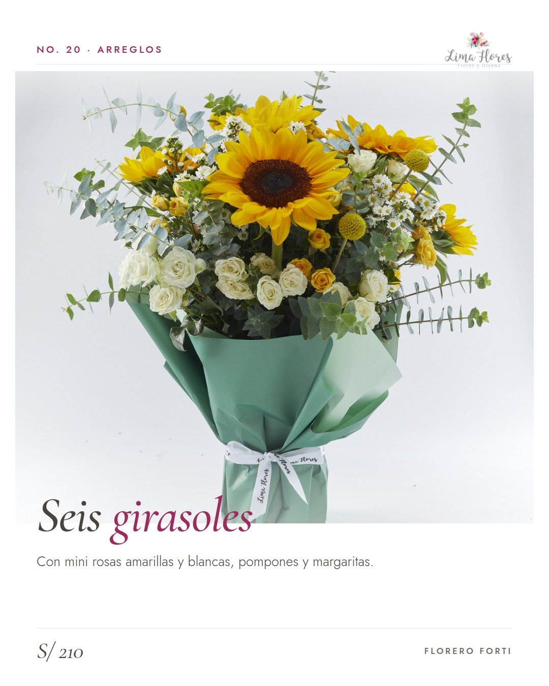

- **Objetivo** Reconocimiento / Tráfico · **Etapa** Frío
- **Ubicación** Feed y Explorar de Instagram · 4:5 (1080×1350)
- **Botón** Comprar

**Texto principal**

> Seis girasoles en el mismo ramo, con mini rosas amarillas y blancas, pompones amarillos y margaritas.
>
> S/210, el día y la hora que elijas.

**Titular** Seis girasoles, no uno

**Descripción** Florero Forti · 6 girasoles · S/210

**Hashtags** #limaflores #girasoles #ramosdeflores #floreslima #miraflores

**Por qué funciona** Los girasoles son lo más visible del catálogo: en el feed frenan el pulgar solos.

---

## 21 · Minis Sandra — S/210

**Categoría** Arreglos · **Ángulo** El color a elegir es el gancho, igual que en los tulipanes, pero en arreglo con globo.

**Público** 22–45, Lima Metropolitana. Cumpleaños. Retargeting de visitantes de Arreglos.

**Destino** `/producto.html?id=minis-sandra`

### IG-33 · Cuatro colores a elegir

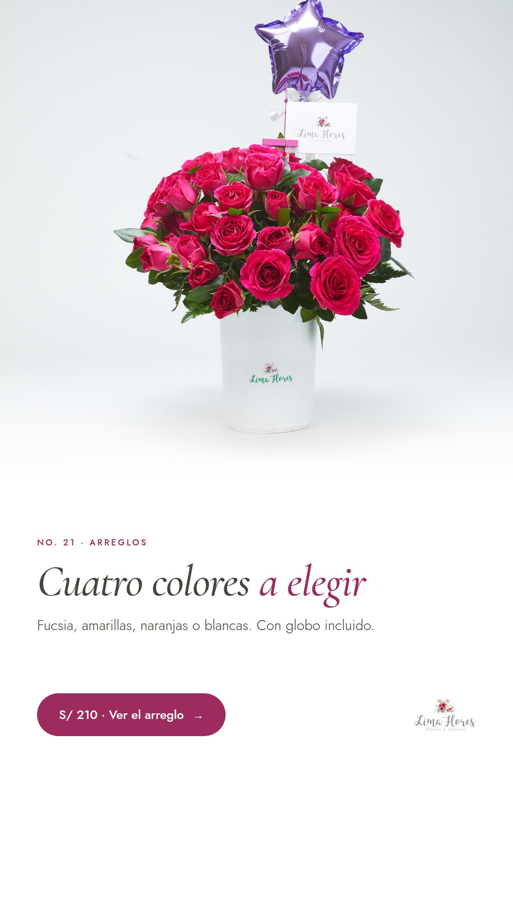

- **Objetivo** Ventas (conversión) · **Etapa** Retargeting caliente
- **Ubicación** Historias y Reels · 9:16 (1080×1920)
- **Botón** Comprar

**Texto principal**

> Minirosas con follaje verde y un globo de estrella morado.
>
> Escoges el color: fucsia, amarillas, naranjas o blancas.
>
> S/210, el día y la hora que elijas.

**Titular** Elige el color de tus minirosas

**Descripción** Minis Sandra · globo incluido · S/210

**Hashtags** #limaflores #minirosas #cumpleaños #floreslima

**Por qué funciona** El color a elegir es el gancho, igual que en los tulipanes, pero en arreglo con globo.

---

## 22 · Box Lila — S/180

**Categoría** Arreglos · **Ángulo** Veinticuatro rosas importadas por S/180: es la mejor relación cantidad-precio del catálogo.

**Público** 25–45, Lima Metropolitana. Aniversario y celebraciones. Público similar al 1% de compradores.

**Destino** `/producto.html?id=box-lila`

### IG-34 · Veinticuatro importadas

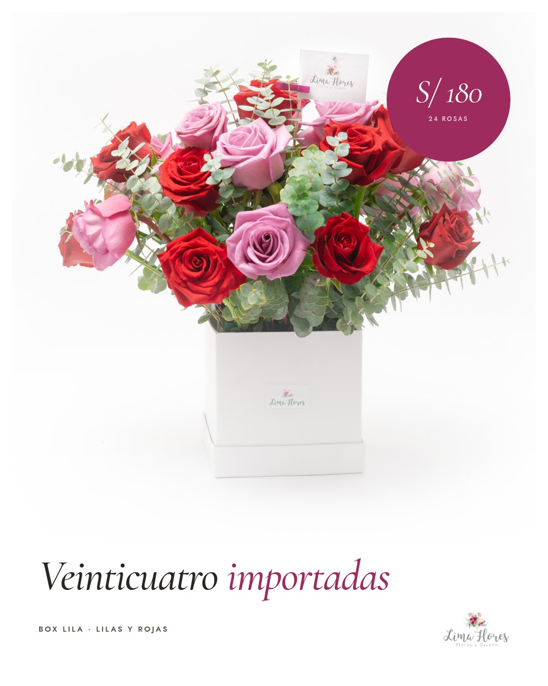

- **Objetivo** Ventas (conversión) · **Etapa** Frío
- **Ubicación** Feed de Instagram · 4:5 (1080×1350)
- **Botón** Comprar

**Texto principal**

> Veinticuatro rosas importadas, lilas y rojas, con follaje verde.
>
> Incluye tarjeta de dedicatoria. S/180, el día y la hora que elijas.

**Titular** 24 rosas importadas por S/180

**Descripción** Box Lila · 24 rosas · S/180

**Hashtags** #limaflores #rosas #arreglosflorales #aniversario #floreslima

**Por qué funciona** Veinticuatro rosas importadas por S/180: es la mejor relación cantidad-precio del catálogo.

---

## 23 · Box Lucy — S/210

**Categoría** Arreglos · **Ángulo** Mismo girasol que el Forti pero en caja: se vende la comodidad, no la flor.

**Público** 25–50, Lima Metropolitana. Cumpleaños y regalo de oficina. Retargeting de Arreglos.

**Destino** `/producto.html?id=box-lucy`

### IG-35 · Girasoles en caja

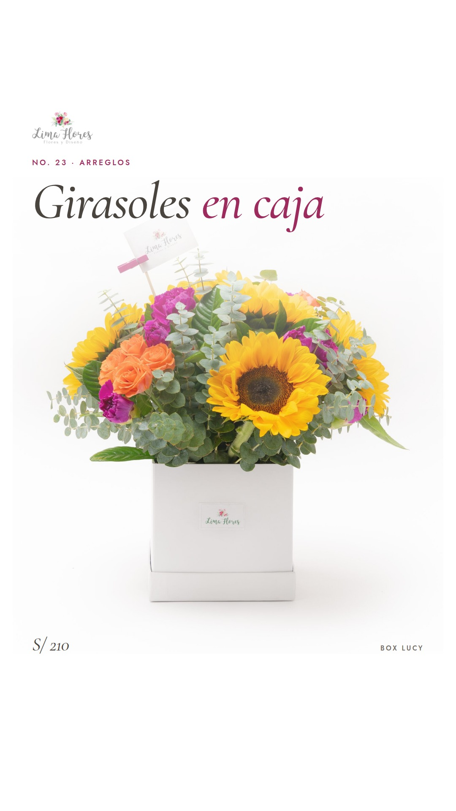

- **Objetivo** Ventas (conversión) · **Etapa** Consideración / Retargeting 30 días
- **Ubicación** Historias y Reels · 9:16 (1080×1920)
- **Botón** Comprar

**Texto principal**

> Seis girasoles con mini rosas naranjas y claveles morados grandes.
>
> Vienen armados en caja, listos para poner sobre la mesa.
>
> S/210, el día y la hora que elijas.

**Titular** Seis girasoles, en caja

**Descripción** Box Lucy · S/210

**Hashtags** #limaflores #girasoles #arreglosflorales #floreslima

**Por qué funciona** Mismo girasol que el Forti pero en caja: se vende la comodidad, no la flor.

---

## 24 · Arreglo Victoria — S/200

**Categoría** Arreglos · **Ángulo** Rosas rojas sin la caja de siempre: el latón es lo que lo diferencia del resto.

**Público** 28–50, Lima Metropolitana. Aniversario y reconciliaciones. Excluir compradores de 30 días.

**Destino** `/producto.html?id=arreglo-victoria`

### IG-36 · Doce rojas en latón

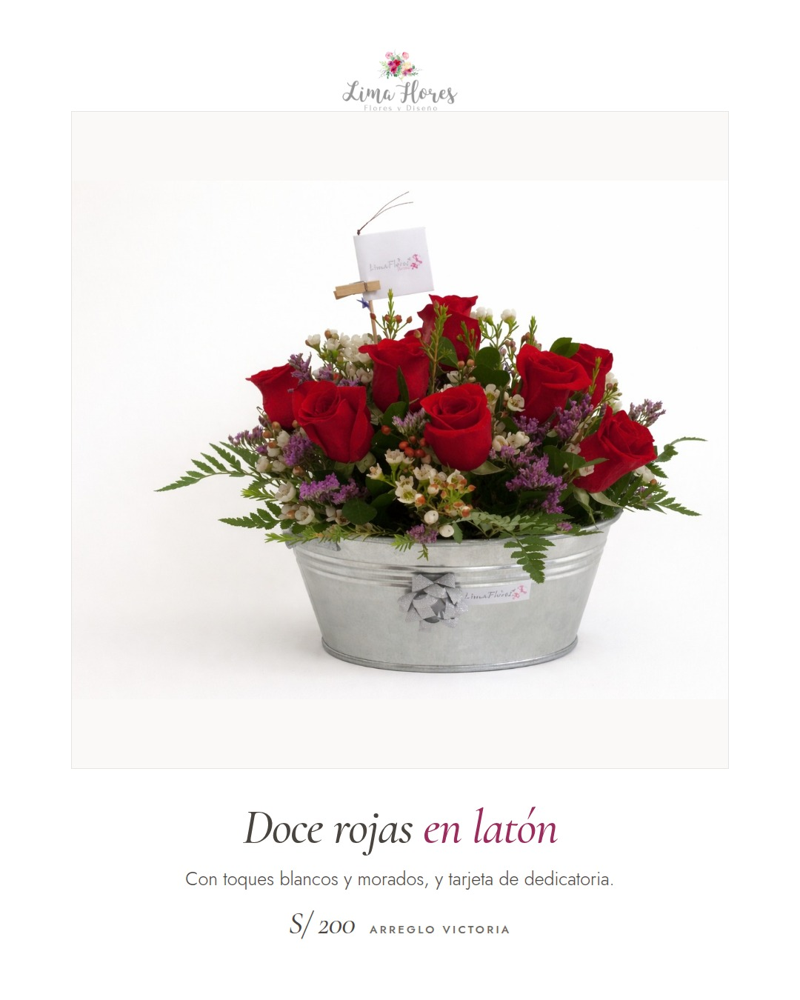

- **Objetivo** Ventas (conversión) · **Etapa** Frío
- **Ubicación** Feed de Instagram · 4:5 (1080×1350)
- **Botón** Comprar

**Texto principal**

> Doce rosas rojas con toques blancos y morados, en latón con follaje verde.
>
> Incluye tarjeta de dedicatoria. S/200, el día y la hora que elijas.

**Titular** Doce rosas rojas en latón

**Descripción** Arreglo Victoria · S/200

**Hashtags** #limaflores #rosasrojas #aniversario #arreglosflorales

**Por qué funciona** Rosas rojas sin la caja de siempre: el latón es lo que lo diferencia del resto.

---

## De dónde sale cada dato

Todo lo que afirma el copy sale de una de estas tres fuentes. Nada es de conocimiento
general ni supuesto.

| Afirmación | Fuente | Texto de origen |
| --- | --- | --- |
| «Eliges el día y la hora» | `app/src/pages/Checkout.tsx` | la fecha mínima es mañana (`minDate = hoy + 1`); las franjas salen de `app/src/lib/delivery.ts` |
| «Entrega en Lima Metropolitana» | landing | «entrega a domicilio dentro de Lima Metropolitana» |
| «Flores frescas los lunes, miércoles y viernes» | landing | «recibe flores frescas los lunes, miércoles y viernes» |
| «Si algo se acaba, te avisamos en menos de una hora» | landing | textual |
| «No vendemos flores. Vendemos pequeños momentos de calma» | landing | textual (manifiesto) |
| «Armado a mano» · «Atelier de Miraflores desde 2017» | landing | «Cada arreglo lo armamos nosotros, a mano» · «Atelier desde 2017» |
| Reseña de Diego V. (IG-05) | landing · reseñas verificadas 2025 | textual, recortada — ver abajo |
| Florero de vidrio, tarjeta, colores, 30×50 cm, composición floral | `db/products.seed.json` | descripción de cada producto |
| Reseña de Camila R. (IG-21) | landing · reseñas verificadas 2025 | textual |
| «Prohibida la venta a menores. Tomar bebidas alcohólicas en exceso es dañino» (IG-28) | `db/products.seed.json` | textual, de la ficha del Box Yani |

### Piezas retiradas

IG-01 a IG-04 se retiraron a pedido. Los códigos **no se renumeraron**, para que las
referencias ya usadas sigan valiendo: la numeración empieza en IG-05. Con IG-04 se fue la
única afirmación que quedaba pendiente de confirmar («8 a 12 semanas»), así que hoy todo el
copy sale de una fuente del proyecto, sin extrapolaciones.

El «Florero con tulipanes lilas» salió del deck porque sus tres piezas eran IG-01 a IG-03.
Los archivos siguen en el historial de git si hicieran falta.

### Cumplimiento: IG-28 lleva alcohol

El Box Yani incluye una botella de Riccadona de 200 ml, así que ese anuncio cae en la categoría
de alcohol de Meta: necesita segmentación de edad **+18** en el conjunto de anuncios y lleva la
advertencia legal en el texto. Sin la restricción de edad, Meta lo rechaza.

### Hallazgos del catálogo

Tres cosas que aparecieron al elegir los productos y conviene arreglar en `db/products.seed.json`:

- **`box-lupita`** — la descripción dice «Box blanco con 12 rosas amarillas y 12 rosas lilas»,
  pero la foto muestra un balde de zinc con rosas amarillas e hortensias blancas y verdes. La
  descripción parece copiada de `box-simona`. Quedó fuera del set por eso.
- **`14536` (Arreglo Florencia)** — su única imagen no es una foto de producto: es una pieza
  gráfica con el nombre, la descripción y el precio ya impresos. No sirve para un creativo.
- **`box-chococafe`** — la descripción menciona «toques azules» que no se ven en la foto. El copy
  del anuncio los omite.

- **Catálogo agotado a esta resolución.** Con estos 23 productos se acabaron los que tienen
  foto de 1000 px o más. Los que quedan son de 500×500: en un lienzo de 1080 se ven blandos,
  así que no entraron. Si el taller sube fotos más grandes, la campaña puede seguir creciendo.

Los cinco productos de la categoría Fúnebre siguen sin foto en el repositorio, así que ninguno
puede entrar a la campaña.

### Qué se quitó y por qué

- **Entrega el mismo día.** Estaba en seis piezas. La landing dice «Te las llevamos hoy», pero
  el checkout exige 24 horas de anticipación: manda el código, no la landing. Reemplazado por
  «eliges el día y la hora», que además es un argumento más fuerte y es verdad.
- **«Tarjeta escrita a mano».** El catálogo dice «tarjeta de dedicatoria». Lo de escrita a mano
  lo había agregado yo.
- **«Los tulipanes siguen creciendo dentro del florero».** Era el gancho de IG-14 y no salía de
  ninguna fuente del proyecto: es cierto en botánica, pero no es un dato del negocio. La pieza
  ahora usa el manifiesto de la landing.
- **«Foto tomada con un celular, sin retoque, en la casa a la que llegó»** (IG-16). Yo no sé
  cómo se tomó esa foto. El copy ahora solo describe lo que se ve: un ramo en una sala.
- **Cifras de duración** («un ramo dura 8 días», «los tulipanes duran una semana»). Eran mías.
- **La mitad de la reseña de Diego V.** («Pedí a las 11 am, llegaron a las 5:30 pm»). Es textual
  del sitio, pero promete entrega el mismo día. Se cita solo la parte de la duración.

Meta pide poder respaldar los testimonios: conviene tener a mano de dónde salió la reseña de
Diego V. antes de publicar IG-05.

## Los nueve formatos

| Plantilla | Qué hace | Cuándo conviene |
| --- | --- | --- |
| `puro` | Foto a sangre y un titular encima. Sin cajas. | Público frío: compite con imagen, no con texto. |
| `sello` | Foto a sangre con un sello de precio, como etiqueta de tienda. | Retargeting: quien ya vio el producto solo necesita el número. |
| `cuadro` | 1:1, la foto entera y el texto apoyado en su zona vacía. | Fotos de celular o de casa, que no parecen anuncio. |
| `titular` | Manda la tipografía; la foto entra como franja al pie. | Rompe el patrón visual cuando el resto del conjunto es todo foto. |
| `postal` | Margen amplio y la foto montada como lámina. Simétrica. | Fotos que no aguantan ir a sangre por resolución o encuadre. |
| `editorial` | Foto grande arriba, titular abajo, filetes finos. | Presentación de producto en público frío. |
| `split` | Panel claro con la lista de entregables + foto a sangre. | Desarmar objeciones de precio: convierte el ticket en una lista. |
| `quote` | Cita grande arriba, foto abajo. | Prueba social o manifiesto de marca. |
| `story` | Banda de foto arriba, texto y botón en zona segura. | Historias de retargeting con llamada a la acción. |

### Tres más, todavía en prueba

`vitrina` (la foto dentro de un arco), `tira` (tres productos con su precio, apoyados en
la misma repisa) y `cifra` (el precio a tamaño de titular). Viven en un carril aparte,
`pruebas.json`, y se rinden en `pruebas/` sin tocar la campaña:

```
python3 marketing/ig-ads/fotos/prep-tira.py  # recortes al ras para las tiras
node marketing/ig-ads/build.mjs --pruebas    # dos piezas de cada formato nuevo
python3 marketing/ig-ads/pruebas.py          # la hoja para decidir cuáles entran
```

**La tira pide fotos parejas, y ahí el catálogo aprieta.** Las tres se ven juntas, así que
cualquier diferencia entre las tomas salta: la que no tenía recorte llenaba el panel y
salía cortada al lado de dos contenidas, y la tomada sobre el gris de estudio aparecía
como un recuadro gris al lado de dos sobre blanco. Lo primero se arregla en la maqueta —
todas contenidas, sobre el recorte al ras de `prep-tira.py`, porque `contain` ajusta el
cuadro y no el producto, y la foto con más aire alrededor rinde el producto más chico. Lo
segundo no: un fondo ya quemado en el JPEG no se empareja con relleno. El generador avisa
cuando las luminancias se separan más de 12, que es cuando todavía se puede cambiar el
producto. Consecuencia: hoy no hay tira posible de tres **ramos** — solo dos están
fotografiados sobre blanco.

**`cifra` recorta a propósito.** Su banda es más ancha que alta, así que la foto entra a
sangre: contenida dejaría dos franjas de relleno que contra el degradado del ciclorama se
ven como una costura vertical. Al ir a sangre hay que decidir por dónde recortar, y eso lo
dice cada anuncio con `position`. Sin eso el recorte cae al centro y le come la punta a
todo lo que sea alto — le pasó a la orquídea de dos varas.

Cuando uno se apruebe, pasa a `ads.json` con su copy, su objetivo y su público, igual que
los otros nueve, y desde ahí entra a la galería de la campaña.

### Los velos no llevan canto

Un `linear-gradient(color, transparent)` tiene la derivada rota justo donde arranca: la
opacidad cae en línea recta y de golpe deja de caer, y el ojo lee esa esquina de la curva
como el borde de un recuadro aunque no haya recuadro. Sobre foto clara se ve peor todavía,
porque el velo blanco no aclara nada y lo único que queda visible es su propio borde: eso
era el rectángulo con fade de IG-22 y IG-30. Los velos van por `velo()` y `veloEsquina()`,
que aproximan una smoothstep y siempre llegan a sangre, así que el único borde recto que
existe es el del lienzo.

De paso apareció otro: el marfil `251,248,241` del velo de las citas era de la paleta
anterior y sobrevivió al paso a blanco total, así que al pie de IG-05, IG-08 e IG-19 había
una banda amarillenta. Ahora el velo saca su color del token, no de un rgb escrito a mano.

Para agregar un anuncio basta con otra entrada en `ads.json`: la plantilla, la foto del
catálogo y el encuadre (`fit`, `position`). El formato sale del campo `format` —
`4:5`, `1:1` o `9:16`.

## Notas de producción

- Fotos: las del catálogo (`app/public/products/`). No se generó ninguna imagen con IA.
- Encuadre: `fotos/prep-fotos.py` detecta el fondo de cada toma y el recuadro que ocupa el
  producto, y guarda una versión recortada a ese recuadro. El generador la mete con `contain`
  sobre un contenedor pintado del mismo color de fondo, así el producto entra completo, ocupa
  lo más posible y no se ve ninguna costura. Un recorte que conserva más del 85% del área se
  descarta: no daba aire y sí cambiaba el encuadre. Las franjas mucho más anchas que altas
  (`titular`, `quote`) usan la toma original a sangre, porque ahí un recorte vertical entraría
  contenido y se vería diminuto.
- Tipografías y paleta: **no se eligen acá**. Se leen del sistema de diseño Florencia
  (`design/direcciones/florencia.css`), que a su vez saca sus colores de medir el ramo del
  logotipo. Hoy: blanco total `#FFFFFF`, tinta cálida `#2A2623`, rosa `#9E2B5E`, y
  Cormorant Garamond en itálica 500 para los titulares con Jost para todo lo demás. Si el
  sistema cambia, los 32 creativos cambian con él sin tocar `build.mjs`.
- Marca: el logo original de la página (`app/public/assets/logo.png`) va en los 18 creativos.
  En `marca/` hay dos versiones, generadas con `marca/prep-logo.py`: `logo.png` para
  fondos claros y `logo-claro.png` para fondos oscuros, donde la caligrafía gris del
  original desaparecería. La versión clara solo cambia el color de la caligrafía; la
  acuarela queda intacta.
- En las historias, los 250px de arriba y los 372px de abajo quedan libres: ahí Instagram
  monta el header del perfil y la barra de respuesta.
- El rubro fúnebre quedó fuera del sorteo: ninguno de sus 5 productos tiene foto en el repo.
