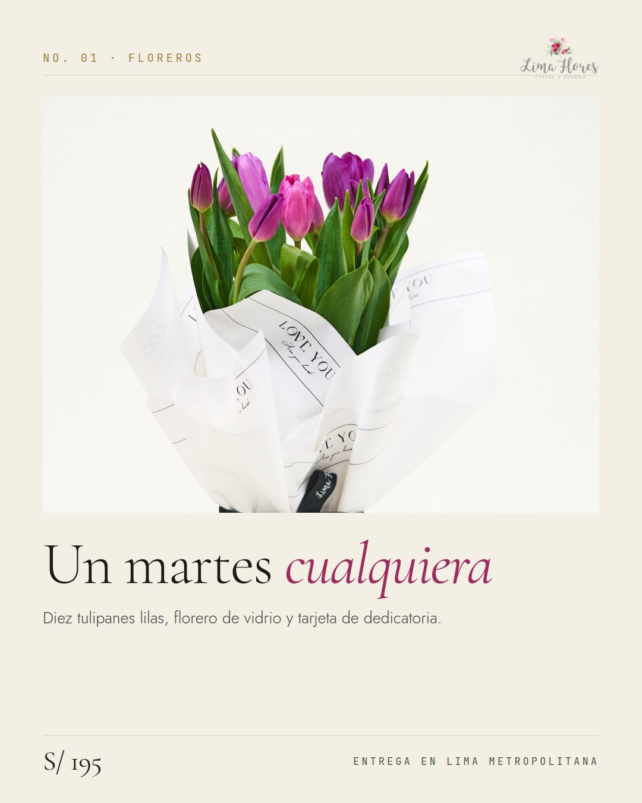
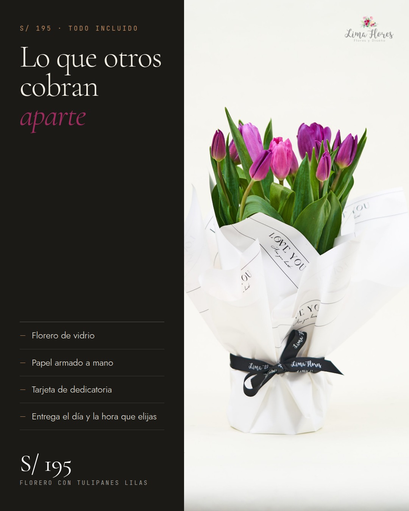
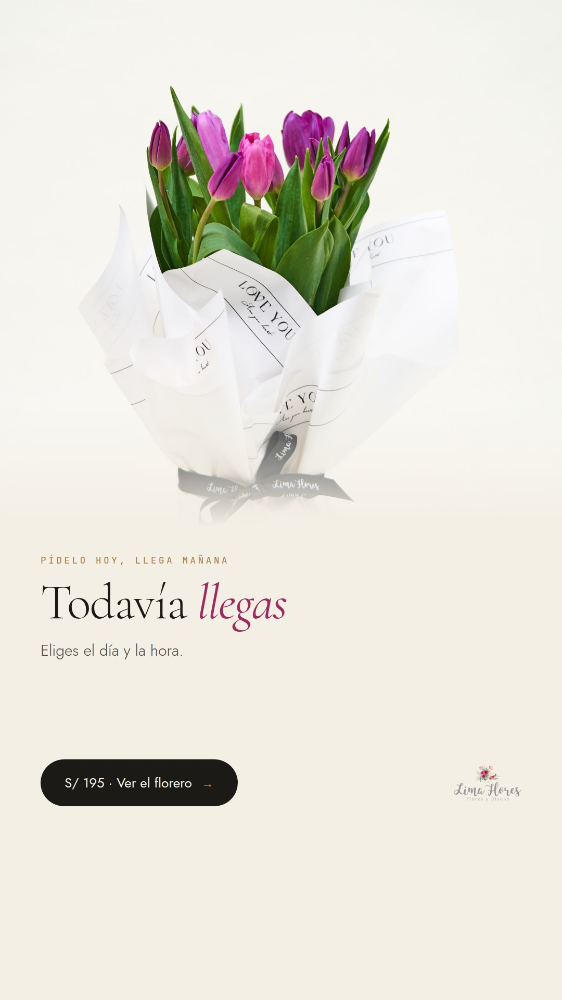
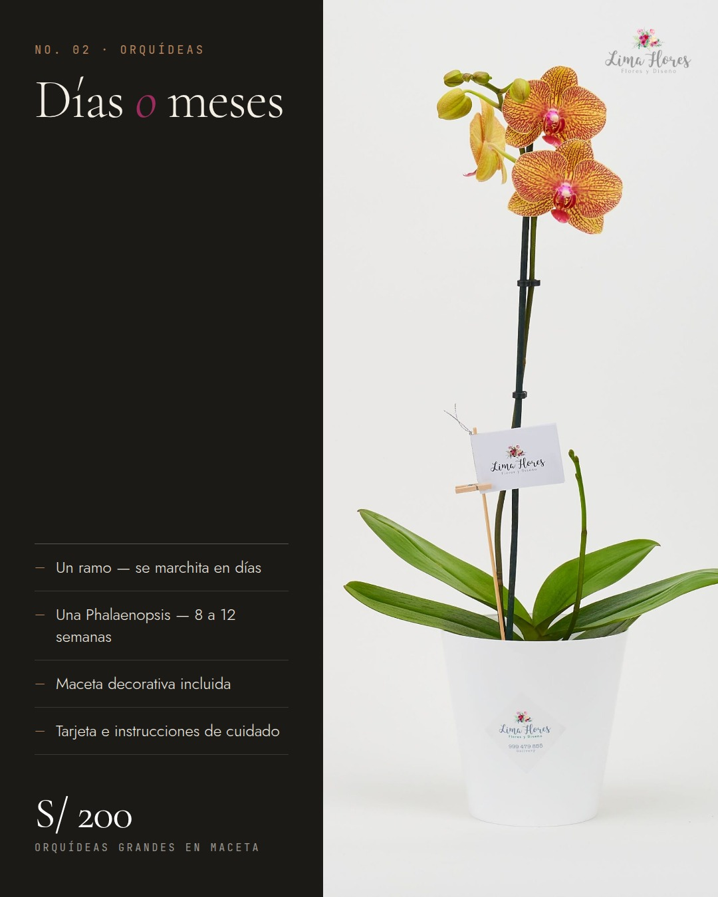

# Campaña de Instagram · Lima Flores

3 productos del catálogo, 3 anuncios cada uno. Copy y creativos hechos íntegramente con Claude.

```
node marketing/ig-ads/build.mjs     # regenera los 9 creativos y este README
```

| Anuncio | Producto | Etapa | Formato | Titular |
| --- | --- | --- | --- | --- |
| `IG-01` | Florero con tulipanes lilas | Frío | 4:5 | Regálale un martes cualquiera |
| `IG-02` | Florero con tulipanes lilas | Consideración / Retargeting 14 días | 4:5 | Lo que otros te cobran aparte |
| `IG-03` | Florero con tulipanes lilas | Retargeting caliente · carrito abandonado 1–3 días | 9:16 | Todavía llegas |
| `IG-04` | Orquídeas grandes en maceta | Frío | 4:5 | Días, o tres meses |
| `IG-05` | Orquídeas grandes en maceta | Consideración / Retargeting 30 días | 4:5 | «Siguen vivas dos meses después» |
| `IG-06` | Orquídeas grandes en maceta | Retargeting caliente | 9:16 | Cuando el ramo no alcanza |
| `IG-07` | Ramo de flores Sofía | Frío | 4:5 | No mandes rosas rojas |
| `IG-08` | Ramo de flores Sofía | Frío — marca | 4:5 | Nadie arma dos iguales |
| `IG-09` | Ramo de flores Sofía | Retargeting caliente | 9:16 | Difícil de decir. Fácil de mandar. |
| `IG-10` | Arreglo Rossie | Frío | 4:5 | Rojo de verdad |
| `IG-11` | Arreglo Rossie | Consideración / Retargeting 14 días | 4:5 | Mide 50 cm. Se nota. |
| `IG-12` | Arreglo Rossie | Retargeting caliente | 9:16 | Cuando «bonito» no alcanza |
| `IG-13` | Tulipanes de amor | Frío | 4:5 | Tú eliges el color |
| `IG-14` | Tulipanes de amor | Frío — marca | 4:5 | Nada de stock |
| `IG-15` | Tulipanes de amor | Retargeting caliente | 9:16 | Elige el color y el día |
| `IG-16` | Ramo Luana | Frío | 1:1 | Para una sala de verdad |
| `IG-17` | Ramo Luana | Frío | 4:5 | Para la amiga que se mudó |
| `IG-18` | Ramo Luana | Retargeting caliente | 9:16 | Los colores que nadie pide |

---

## 01 · Florero con tulipanes lilas — S/195

**Categoría** Floreros · **Ángulo** Regalo sin ocasión + el florero de vidrio como valor tangible.

**Público** Mujeres y hombres 25–45, Lima Metropolitana (Miraflores, San Isidro, Surco, Barranco, La Molina, San Borja). Intereses: regalos, decoración, gastronomía, viajes. Lookalike 1% de compradores.

**Destino** `/producto.html?id=sorprende-con-un-florero-de-tulipanes-lilas-el-regalo-perfecto-para-cualquier-ocasion`

### IG-01 · Un martes cualquiera



- **Objetivo** Reconocimiento / Tráfico · **Etapa** Frío
- **Ubicación** Feed y Explorar de Instagram · 4:5 (1080×1350)
- **Botón** Comprar

**Texto principal**

> Los cumpleaños ya están tomados. El aniversario también.
>
> Lo que nadie ve venir es un martes a las 4 de la tarde, sin motivo, con diez tulipanes lilas y una tarjeta de dedicatoria.
>
> Eso es lo que la gente cuenta después.
>
> Florero de vidrio incluido. Tú eliges el día y la hora de entrega.

**Titular** Regálale un martes cualquiera

**Descripción** 10 tulipanes · florero de vidrio · S/195

**Hashtags** #limaflores #floreslima #tulipanes #regalosperu #deliverylima #miraflores

**Por qué funciona** El gancho compite con el motivo, no con el precio: saca al producto de la temporada de campañas (Día de la Madre, San Valentín) donde el CPM se dispara.

### IG-02 · Lo que otros cobran aparte



- **Objetivo** Ventas (conversión) · **Etapa** Consideración / Retargeting 14 días
- **Ubicación** Feed de Instagram · 4:5 (1080×1350)
- **Botón** Comprar

**Texto principal**

> S/195 no es el precio de diez tulipanes.
>
> Es el florero de vidrio, que no cobramos aparte. El papel armado a mano. La tarjeta con lo que no te animas a decir en voz alta. Y alguien manejando hasta su puerta el día y la hora que elijas.
>
> Las flores se van. El florero se queda.

**Titular** Lo que otros te cobran aparte

**Descripción** Florero, tarjeta y entrega incluidos

**Hashtags** #limaflores #floreslima #tulipaneslima #regalosconsentido #deliveryflores

**Por qué funciona** Desarma la objeción de precio convirtiendo el ticket en una lista de entregables. Va a quien ya vio el producto y no compró.

### IG-03 · Todavía llegas



- **Objetivo** Ventas (conversión) · **Etapa** Retargeting caliente · carrito abandonado 1–3 días
- **Ubicación** Historias y Reels · 9:16 (1080×1920)
- **Botón** Comprar

**Texto principal**

> Te olvidaste. Está bien: si lo pides hoy, llega mañana.
>
> Tulipanes lilas con florero de vidrio incluido. Eliges el día y la hora de entrega en Lima Metropolitana.

**Titular** Todavía llegas

**Descripción** S/195 · pídelo hoy, llega mañana

**Hashtags** #limaflores #deliverylima #floresadomicilio

**Por qué funciona** Urgencia sin descuento. El descuento entrena a esperar ofertas; recordar que el pedido de hoy llega mañana no toca el margen.

---

## 02 · Orquídeas grandes en maceta — S/200

**Categoría** Orquídeas · **Ángulo** Durabilidad (8–12 semanas) frente al ramo que se marchita en 8 días.

**Público** 30–55, Lima Metropolitana. Momentos: agradecimiento, casa nueva, jefas/suegras, cumpleaños de mamá. Retargeting 30 días de visitantes de /catalogo.html categoría Orquídeas.

**Destino** `/producto.html?id=orquideas-grandes-en-maceta`

### IG-04 · Ocho días vs. tres meses



- **Objetivo** Ventas (conversión) · **Etapa** Frío
- **Ubicación** Feed y Explorar de Instagram · 4:5 (1080×1350)
- **Botón** Comprar

**Texto principal**

> Un ramo se marchita en días. Una Phalaenopsis aguanta entre ocho y doce semanas con riego mínimo.
>
> Misma inversión, mucho más tiempo recordándote.
>
> Viene en maceta decorativa, con tarjeta de dedicatoria e instrucciones de cuidado para que no se muera en la oficina.

**Titular** Días, o tres meses

**Descripción** Phalaenopsis en maceta · S/200

**Hashtags** #limaflores #orquideas #phalaenopsis #regalosperu #plantaslima

**Por qué funciona** Compara contra la categoría entera, no contra otra floristería. Reencuadra el precio como costo por semana.

### IG-05 · Dos meses después


- **Objetivo** Ventas (conversión) · **Etapa** Consideración / Retargeting 30 días
- **Ubicación** Feed de Instagram · 4:5 (1080×1350)
- **Botón** Comprar

**Texto principal**

> «Las orquídeas siguen vivas dos meses después. Recomiendo cerrado los ojos.»
>
> — Diego V., San Isidro · reseña verificada
>
> Eso es exactamente lo que vendemos: algo que sigue vivo cuando ya nadie se acuerda del regalo.
>
> Phalaenopsis en maceta decorativa, con tarjeta e instrucciones de cuidado.

**Titular** «Siguen vivas dos meses después»

**Descripción** Orquídeas en maceta · S/200

**Hashtags** #limaflores #orquideas #reseñasreales #deliverylima

**Por qué funciona** Prueba social textual del propio sitio. Cubre la objeción que de verdad frena la compra de una planta como regalo: que se muera a la semana.

### IG-06 · Cuando el ramo no alcanza


- **Objetivo** Ventas (conversión) · **Etapa** Retargeting caliente
- **Ubicación** Historias y Reels · 9:16 (1080×1920)
- **Botón** Comprar

**Texto principal**

> Para la suegra. Para la jefa. Para la casa nueva. Para el gracias que se te quedó pendiente hace tres semanas.
>
> Orquídea Phalaenopsis en maceta, entregada el día y la hora que elijas.

**Titular** Cuando el ramo no alcanza

**Descripción** S/200 · eliges día y hora

**Hashtags** #limaflores #orquideas #regalosperu

**Por qué funciona** Lista de ocasiones: deja que la persona se reconozca en una de las cuatro en menos de dos segundos.

---

## 03 · Ramo de flores Sofía — S/160

**Categoría** Ramos · **Ángulo** Anti–rosas rojas: criterio estético a precio de entrada, armado a mano.

**Público** 22–40, Lima Metropolitana. Público de entrada de precio y gusto estético: diseño, arquitectura, café de especialidad, decoración. Primer contacto con la marca.

**Destino** `/producto.html?id=ramo-de-flores-sofia`

### IG-07 · No mandes rosas rojas


- **Objetivo** Reconocimiento / Tráfico · **Etapa** Frío
- **Ubicación** Feed y Explorar de Instagram · 4:5 (1080×1350)
- **Botón** Comprar

**Texto principal**

> Doce rosas rojas dicen «pasé por el mercado camino a tu casa».
>
> Rosas blancas, pompones verde limón, una flor exótica amarilla y eucalipto dicen «me senté a pensar en ti».
>
> El mismo gesto, cuesta menos, se nota más.
>
> Ramo Sofía, armado a mano en el atelier de Miraflores.

**Titular** No mandes rosas rojas

**Descripción** Ramo Sofía · hecho a mano · S/160

**Hashtags** #limaflores #ramosdeflores #floreslima #eucalipto #miraflores #regalosperu

**Por qué funciona** Gancho negativo contra el default de la categoría. Alto CTR en frío porque contradice lo que la gente iba a hacer igual.

### IG-08 · Nadie arma dos iguales


- **Objetivo** Tráfico / Interacción · **Etapa** Frío — marca
- **Ubicación** Feed de Instagram · 4:5 (1080×1350)
- **Botón** Más información

**Texto principal**

> No tenemos stock. Recibimos flores frescas lunes, miércoles y viernes, y cuando pides un ramo alguien se sienta, mira lo que llegó esa mañana y te lo arma.
>
> Por eso ningún Sofía sale idéntico al de la foto. Y por eso ninguno se parece a los de la tienda de la esquina.
>
> Atelier en Miraflores desde 2017.

**Titular** Nadie arma dos iguales

**Descripción** Desde S/160 · hecho a mano

**Hashtags** #limaflores #hechoamano #atelierfloral #miraflores #floreslima

**Por qué funciona** Anuncio de marca para alimentar los públicos de retargeting de IG-07 e IG-09 a CPM bajo. Es el manifiesto del propio sitio, sin cambiarle una palabra.

### IG-09 · Cuatro cosas difíciles de decir


- **Objetivo** Ventas (conversión) · **Etapa** Retargeting caliente
- **Ubicación** Historias y Reels · 9:16 (1080×1920)
- **Botón** Comprar

**Texto principal**

> Gracias. Perdón. Felicitaciones. Te extraño.
>
> Cuatro cosas difíciles de decir y una sola manera de decirlas bien. Ramo Sofía, hecho a mano, entregado el día que elijas.

**Titular** Difícil de decir. Fácil de mandar.

**Descripción** Desde S/160 · eliges día y hora

**Hashtags** #limaflores #floreslima #deliverylima

**Por qué funciona** El texto hace el trabajo de segmentación solo: cada línea es una intención de compra distinta y el clic revela cuál.

---

## 04 · Arreglo Rossie — S/245

**Categoría** Arreglos · **Ángulo** Es el producto caro del set: se vende presencia y tamaño (30×50 cm), no cantidad de tallos.

**Público** 28–50, Lima Metropolitana. Momentos de ticket alto: aniversario, San Valentín, reconciliaciones, pedidas de mano. Excluir compradores de los últimos 30 días.

**Destino** `/producto.html?id=arreglo-rossie`

### IG-10 · Rojo de verdad


- **Objetivo** Reconocimiento / Tráfico · **Etapa** Frío
- **Ubicación** Feed y Explorar de Instagram · 4:5 (1080×1350)
- **Botón** Comprar

**Texto principal**

> Hay un rojo de supermercado y hay este.
>
> Rosas, gerberas, claveles importados y pepitas rojas apretadas hasta que no entra una flor más, en florero de vidrio.
>
> Mide 50 cm de alto y ocupa la mesa entera. S/245, el día y la hora que elijas.

**Titular** Rojo de verdad

**Descripción** Arreglo Rossie · 30×50 cm · S/245

**Hashtags** #limaflores #floreslima #rosasrojas #aniversario #deliverylima

**Por qué funciona** Foto a sangre y una sola frase: en el feed compite con imagen, no con texto. El macro del arreglo es lo más fuerte que tiene el catálogo.

### IG-11 · Ocupa la mesa entera


- **Objetivo** Ventas (conversión) · **Etapa** Consideración / Retargeting 14 días
- **Ubicación** Feed de Instagram · 4:5 (1080×1350)
- **Botón** Comprar

**Texto principal**

> 30 cm de ancho por 50 de alto.
>
> No es el detalle que se pone al costado del plato: es lo primero que ve cuando entra a la casa.
>
> Rosas, gerberas y claveles importados en florero de vidrio, armado a mano. S/245.

**Titular** Mide 50 cm. Se nota.

**Descripción** Florero de vidrio incluido · S/245

**Hashtags** #limaflores #arreglosflorales #floreslima #regalosperu

**Por qué funciona** El sello de precio hace el trabajo del texto: quien ya vio el producto necesita el número, no otro párrafo. La medida en el sello responde la pregunta real, que es el tamaño.

### IG-12 · Cuando bonito no alcanza


- **Objetivo** Ventas (conversión) · **Etapa** Retargeting caliente
- **Ubicación** Historias y Reels · 9:16 (1080×1920)
- **Botón** Comprar

**Texto principal**

> Aniversarios, disculpas grandes, sí definitivos.
>
> Hay momentos en los que un ramo correcto no dice lo suficiente. Para eso está el Rossie: rojo cerrado, 50 cm, florero de vidrio incluido.
>
> S/245, en Lima Metropolitana.

**Titular** Cuando «bonito» no alcanza

**Descripción** Arreglo Rossie · S/245

**Hashtags** #limaflores #aniversario #floreslima

**Por qué funciona** Invierte la jerarquía: el texto es el creativo y la foto entra como franja. Rompe el patrón visual de las otras historias en el mismo feed.

---

## 05 · Tulipanes de amor — S/195

**Categoría** Floreros · **Ángulo** Personalización: es el único del set donde el cliente elige el color.

**Público** 25–45, Lima Metropolitana. Regalo de cumpleaños y de pareja. Buen público para públicos similares al 1% de compradores de Floreros.

**Destino** `/producto.html?id=tulipanes-de-amor`

### IG-13 · Tú eliges el color


- **Objetivo** Ventas (conversión) · **Etapa** Frío
- **Ubicación** Feed y Explorar de Instagram · 4:5 (1080×1350)
- **Botón** Comprar

**Texto principal**

> Diez tulipanes en florero de vidrio. Tú eliges: amarillo, rojo, morado, naranja, blanco, o el mix de todos como en la foto.
>
> Viene con papel decorativo y tarjeta de dedicatoria. S/195, el día y la hora que elijas.

**Titular** Tú eliges el color

**Descripción** 10 tulipanes · florero incluido · S/195

**Hashtags** #limaflores #tulipanes #floreslima #regalosperu #deliverylima

**Por qué funciona** La foto ya tiene el aire arriba: el texto se apoya en el fondo crema sin recuadros ni velos. Es el formato más limpio del set y el que mejor pasa por publicación orgánica.

### IG-14 · Nada de stock


- **Objetivo** Tráfico / Interacción · **Etapa** Frío — marca
- **Ubicación** Feed de Instagram · 4:5 (1080×1350)
- **Botón** Más información

**Texto principal**

> No tenemos stock. Recibimos flores frescas los lunes, miércoles y viernes, y lo que está disponible es lo que llegó esa semana.
>
> Si algo se acaba, te avisamos en menos de una hora.
>
> Diez tulipanes en florero de vidrio, con papel decorativo y tarjeta de dedicatoria. S/195.

**Titular** Nada de stock

**Descripción** Tulipanes de amor · florero incluido · S/195

**Hashtags** #limaflores #tulipanes #atelierfloral #floreslima

**Por qué funciona** Es el manifiesto de la propia landing, sin cambiarle una palabra. Explica por qué el catálogo cambia y convierte esa limitación en argumento.

### IG-15 · Elige el color, llega hoy


- **Objetivo** Ventas (conversión) · **Etapa** Retargeting caliente
- **Ubicación** Historias y Reels · 9:16 (1080×1920)
- **Botón** Comprar

**Texto principal**

> Amarillo, rojo, morado, naranja o blanco.
>
> Diez tulipanes en florero de vidrio. Eliges el color, el día y la hora. Desliza y arma el tuyo.

**Titular** Elige el color y el día

**Descripción** S/195 · eliges día y hora

**Hashtags** #limaflores #tulipanes #deliverylima

**Por qué funciona** Mismo formato limpio que IG-13 en vertical, para medir si el gancho del color rinde igual en historias que en feed sin cambiar nada más.

---

## 06 · Ramo Luana — S/180

**Categoría** Ramos · **Ángulo** La foto está tomada en una sala y no en un fondo blanco: se vende cercanía.

**Público** 22–40, Lima Metropolitana. Primera compra, regalo casual entre amigas, mudanzas y agradecimientos. Público frío amplio.

**Destino** `/producto.html?id=ramo-luana`

### IG-16 · Para una sala de verdad


- **Objetivo** Reconocimiento / Tráfico · **Etapa** Frío
- **Ubicación** Feed de Instagram · 1:1 (1080×1080)
- **Botón** Comprar

**Texto principal**

> Mini rosas naranjas, siemprevivas moradas, pompones verdes y toques amarillos, con follaje verde.
>
> Un ramo para una sala de verdad, no para una vitrina. S/180, armado a mano en el atelier de Miraflores.

**Titular** Para una sala de verdad

**Descripción** Ramo Luana · S/180

**Hashtags** #limaflores #ramosdeflores #floreslima #hechoamano #miraflores

**Por qué funciona** La foto está tomada en una sala y no en un fondo blanco: en el feed no parece anuncio, que es justo lo que conviene en público frío amplio.

### IG-17 · Para la amiga que se mudó


- **Objetivo** Tráfico · **Etapa** Frío
- **Ubicación** Feed y Explorar de Instagram · 4:5 (1080×1350)
- **Botón** Más información

**Texto principal**

> No todo regalo tiene que ser un acontecimiento.
>
> Este es para la amiga que se mudó, para la casa de tu mamá, para el jueves en que alguien la pasó mal.
>
> Mini rosas naranjas, siemprevivas moradas y pompones verdes, armado a mano. S/180.

**Titular** Para la amiga que se mudó

**Descripción** Ramo Luana · hecho a mano · S/180

**Hashtags** #limaflores #ramosdeflores #regalosconsentido #floreslima

**Por qué funciona** Nombra una ocasión chica y concreta en vez de una fecha del calendario: vende en los diez meses del año en que no hay campaña.

### IG-18 · Los colores que nadie pide


- **Objetivo** Ventas (conversión) · **Etapa** Retargeting caliente
- **Ubicación** Historias y Reels · 9:16 (1080×1920)
- **Botón** Comprar

**Texto principal**

> Naranjas, morados y verdes en el mismo ramo: los colores que nadie pide y todos miran.
>
> Hecho a mano en el atelier de Miraflores, entregado el día que elijas. S/180.

**Titular** Los colores que nadie pide

**Descripción** Ramo Luana · S/180

**Hashtags** #limaflores #floreslima #deliverylima

**Por qué funciona** El marco de postal separa el producto del fondo del feed y da aire: funciona bien cuando la foto es de celular y no aguanta ir a sangre en vertical.

---

## De dónde sale cada dato

Todo lo que afirma el copy sale de una de estas tres fuentes. Nada es de conocimiento
general ni supuesto.

| Afirmación | Fuente | Texto de origen |
| --- | --- | --- |
| «Eliges el día y la hora» · «Pídelo hoy, llega mañana» | `site/js/checkout.js` | `LEAD_MS = 24h`; el cliente elige fecha y slot de 30 min entre 8:00 y 20:30, con ventana de ±30 min |
| «Entrega en Lima Metropolitana» | landing | «entrega a domicilio dentro de Lima Metropolitana» |
| «Flores frescas los lunes, miércoles y viernes» | landing | «recibe flores frescas los lunes, miércoles y viernes» |
| «Si algo se acaba, te avisamos en menos de una hora» | landing | textual |
| «No vendemos flores. Vendemos pequeños momentos de calma» | landing | textual (manifiesto) |
| «Armado a mano» · «Atelier de Miraflores desde 2017» | landing | «Cada arreglo lo armamos nosotros, a mano» · «Atelier desde 2017» |
| Reseña de Diego V. (IG-05) | landing · reseñas verificadas 2025 | textual, recortada — ver abajo |
| Florero de vidrio, tarjeta, colores, 30×50 cm, composición floral | `db/products.seed.json` | descripción de cada producto |
| «8 a 12 semanas» (IG-04) | landing, **pero de otro producto** | «Duran entre ocho y doce semanas con riego mínimo», dicho de las Orquídeas Multicolor |

### Lo único que queda por decidir

El **«8 a 12 semanas»** de IG-04. La cifra está publicada en la landing, pero referida a las
Orquídeas Multicolor, no a las Orquídeas grandes en maceta que anuncia esa pieza. Es la misma
especie (Phalaenopsis) y por eso se dejó, pero es una extrapolación, no un dato del producto.
Si el taller no la respalda, la comparación funciona igual diciendo «semanas, no días».

### Qué se quitó y por qué

- **Entrega el mismo día.** Estaba en seis piezas. La landing dice «Te las llevamos hoy», pero
  el checkout exige 24 horas de anticipación: manda el código, no la landing. Reemplazado por
  «eliges el día y la hora», que además es un argumento más fuerte y es verdad.
- **«Tarjeta escrita a mano».** El catálogo dice «tarjeta de dedicatoria». Lo de escrita a mano
  lo había agregado yo.
- **«Los tulipanes siguen creciendo dentro del florero».** Era el gancho de IG-14 y no salía de
  ninguna fuente del proyecto: es cierto en botánica, pero no es un dato del negocio. La pieza
  ahora usa el manifiesto de la landing.
- **«Foto tomada con un celular, sin retoque, en la casa a la que llegó»** (IG-16). Yo no sé
  cómo se tomó esa foto. El copy ahora solo describe lo que se ve: un ramo en una sala.
- **«Un ramo dura 8 días»** (IG-04) y **«los tulipanes duran una semana»** (IG-02). Cifras mías.
- **La mitad de la reseña de Diego V.** («Pedí a las 11 am, llegaron a las 5:30 pm»). Es textual
  del sitio, pero promete entrega el mismo día. Se cita solo la parte de la duración.

Meta pide poder respaldar los testimonios: conviene tener a mano de dónde salió la reseña de
Diego V. antes de publicar IG-05.

## Los nueve formatos

| Plantilla | Qué hace | Cuándo conviene |
| --- | --- | --- |
| `puro` | Foto a sangre y un titular encima. Sin cajas. | Público frío: compite con imagen, no con texto. |
| `sello` | Foto a sangre con un sello de precio, como etiqueta de tienda. | Retargeting: quien ya vio el producto solo necesita el número. |
| `cuadro` | 1:1, la foto entera y el texto apoyado en su zona vacía. | Fotos de celular o de casa, que no parecen anuncio. |
| `titular` | Manda la tipografía; la foto entra como franja al pie. | Rompe el patrón visual cuando el resto del conjunto es todo foto. |
| `postal` | Margen amplio y la foto montada como lámina. Simétrica. | Fotos que no aguantan ir a sangre por resolución o encuadre. |
| `editorial` | Foto grande arriba, titular abajo, filetes finos. | Presentación de producto en público frío. |
| `split` | Panel oscuro con la lista de entregables + foto a sangre. | Desarmar objeciones de precio: convierte el ticket en una lista. |
| `quote` | Cita grande arriba, foto abajo. | Prueba social o manifiesto de marca. |
| `story` | Banda de foto arriba, texto y botón en zona segura. | Historias de retargeting con llamada a la acción. |

Para agregar un anuncio basta con otra entrada en `ads.json`: la plantilla, la foto del
catálogo y el encuadre (`fit`, `position`). El formato sale del campo `format` —
`4:5`, `1:1` o `9:16`.

## Notas de producción

- Fotos: las del catálogo (`site/assets/products/`). No se generó ninguna imagen con IA.
- Tipografías y paleta: las del sitio (`site/css/lima.css`) — Cormorant Garamond, Jost,
  JetBrains Mono sobre hueso `#F4EFE5` y tinta `#1B1A17`.
- Marca: el logo original de la página (`site/assets/logo.png`) va en los 18 creativos.
  En `marca/` hay dos versiones, generadas con `marca/prep-logo.py`: `logo.png` para
  fondos claros y `logo-claro.png` para fondos oscuros, donde la caligrafía gris del
  original desaparecería. La versión clara solo cambia el color de la caligrafía; la
  acuarela queda intacta.
- En las historias, los 250px de arriba y los 372px de abajo quedan libres: ahí Instagram
  monta el header del perfil y la barra de respuesta.
- El rubro fúnebre quedó fuera del sorteo: ninguno de sus 5 productos tiene foto en el repo.
